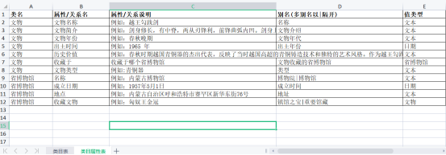
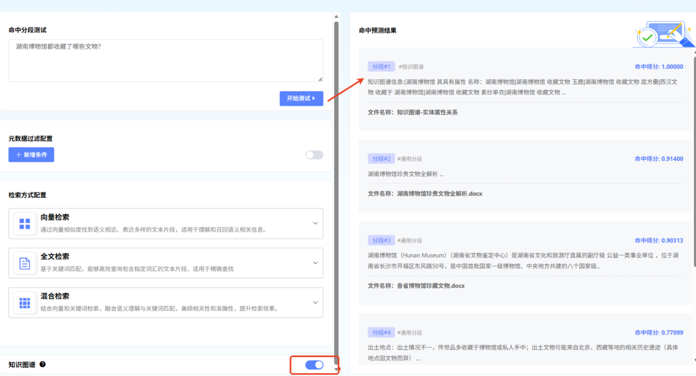

# 知识图谱

## 1 什么是知识图谱？
知识图谱本质上是一个**语义网络**，它用图的形式来描述现实世界中的概念、实体及其相互关系。它由以下核心元素构成：
*   **节点**：代表现实世界中的“实体”（如：人物、公司、产品）或“概念”（如：国家、行业）。
*   **边**：代表节点之间的“关系”（如：[张三] -`就职于`-> [阿里巴巴]）。
*   **属性**：描述节点或边的特征信息（如：[张三] 节点有属性 `年龄: 30`，`职位: 算法工程师`）。
与传统的关系型数据库（表格）不同，知识图谱的结构更灵活，更擅长处理复杂、多跳的关联查询和推理。
## 2 为什么智能体需要知识图谱？
智能体（如聊天机器人、智能助手）仅依赖大语言模型时，可能会遇到以下问题：
*   **事实幻觉**：生成看似合理但与事实不符的信息。
*   **知识滞后**：无法获取训练数据截止日期之后的新知识。
*   **缺乏深度推理**：难以回答需要跨多个实体进行复杂关联分析的问题。

知识图谱可以为智能体提供：

*   **事实依据**：作为结构化的“事实数据库”，为智能体提供准确、可验证的信息。
*   **增强推理**：支持多跳查询，回答“XX公司的CEO的母校是哪里？”这类复杂问题。
*   **可解释性**：答案可以追溯到知识图谱中的具体路径，增强了回答的可信度。

---
## 3 核心概念解析
| 概念       | 解释                                                         | 示例                                                  |
| ---------- | ------------------------------------------------------------ | ----------------------------------------------------- |
| **实体**   | 现实世界中可区分的独立事物。                                 | `苹果公司`、`iPhone 15`、`蒂姆·库克`                  |
| **关系**   | 连接两个实体，描述它们之间的某种联系。                       | `生产`、`是...的CEO`、`发布于`                        |
| **属性**   | 实体或关系的特征或描述。                                     | `iPhone 15` 的属性：`颜色: 深空黑`、`存储容量: 256GB` |
| **三元组** | 知识图谱的基本组成单元，形式为 `(主语, 谓语, 宾语)` 或 `(实体, 关系, 实体/值)`。 | `(蒂姆·库克, 是...的CEO, 苹果公司)`                   |
## 4 知识图谱使用流程

#### 1）创建知识图谱

新建知识库，开启【知识图谱】选项，并从模型中选择用于实体关系抽取模型，下载图谱schema模板：

**样例数据下载：** https://pan.baidu.com/s/5xbmxRupm_lWPKFeR4DfEBQ 

基于图谱Schema的本体（**Ontology**）建模:

**【知识图谱schema概念】**

数据描述规范，也称schema，是知识图谱数据生产所必需的一套规范。这套规范可用于描述、规范化知识表示的本体结构。知识图谱构建首先要对业务进行分析建模，也就是先定义好“类”、“类的属性”及“类与类之间的关系”。

下面以博物馆收藏的文物语料为例（可下载样例数据进行体验），介绍一下类目和属性关系的定义方式：

**GraphRAG构建过程和增强效果**（基于各省博物馆收藏的文物语料为例-样例数据）：

其中湖南博物馆在下面多篇文档中均有提到相关文物收藏情况：

|                   文档A按文物分类介绍文物                    |                   文档B介绍湖南博物馆文物                    |                  文档C介绍省博物馆重要馆藏                   |
| :----------------------------------------------------------: | :----------------------------------------------------------: | :----------------------------------------------------------: |
|  |  |  |

首先我们在schema模板中的【类目表】中定义知识图谱中的实体类目：

其次在【类目属性表】定义每个类名对应的属性及关系，当值类型为另外一个类名时表示此属性为关系，否则为属性。例如下表中文物的【收藏于】的值类型为【省博物馆】表示为文物指向省博物馆的边关系；文物名称/出土时间值类型为非实体类型时表示属性。

按模板定义完图谱schema后，上传图谱schema文件后完成知识库创建初始化

然后往知识库中导入各省博物馆收藏的文物文档：

设置分段方式和解析方式后，点击【确定】执行导入操作：

在文档解析状态处理完成后，图谱解析状态会由“待处理”->“解析中”->“解析成功”

当解析成功后，在上方按钮区域会出现【知识图谱】和【社区报告】按钮

#### 2）查看知识图谱

当所有文件的图谱解析状态均为解析成功时，可以点击【知识图谱】按钮查看图谱效果：

点击【知识图谱】，可查看知识图谱详情，以及知识图谱生成进度。

#### 3）生成社区报告

**社区报告：**基于知识图谱，通过社区检测算法，将图谱按主题划分为多个社区，并为每个社区生成的主题报告（用于描述该社区内的所有实体级关系）。社区报告在查询时作为一类综合性知识参与检索召回。适合应用于综合性全局问答类场景使用。

在知识图谱构建完成后，点击【社区报告】按钮进入社区报告管理界面：

**提示：**社区报告需要在知识图片解析完成之后，才能生成。需要用户手动点击生成。社区报告在上传文件或删除文件时不会自动触发构建,如需更新报告需要点击生成/重新生成构建。重新生成社区报告，会默认删除已生成的社区报告。

点击【生成】触发此知识库的社区报告构建，点击【刷新数据】可查看状态

#### 4）命中测试

在进行命中测试的过程中，可开启知识图片按钮

#### 5）文本问答、智能体、工作流

在文本问答、智能体、工作流（知识库检索节点），均可开启知识图谱功能。

提示：若要开启知识图谱开关，前提为选择设置了知识图谱的知识库。若在创建知识库时没有开启知识图谱，则在应用中无法配置。

