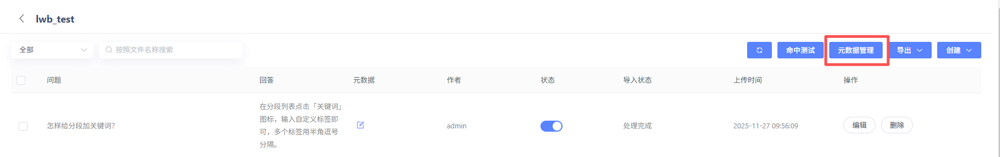
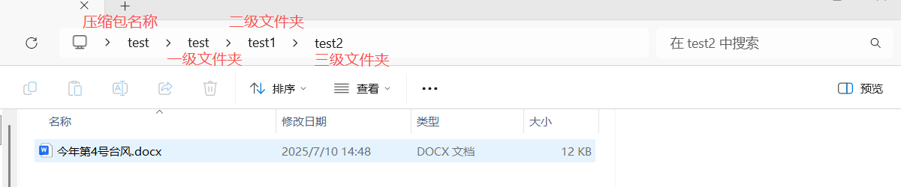
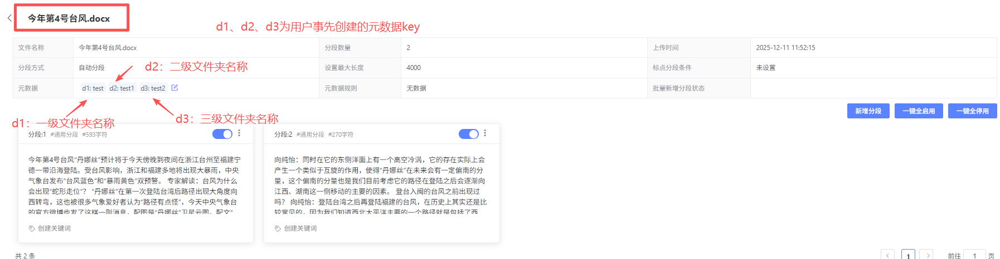
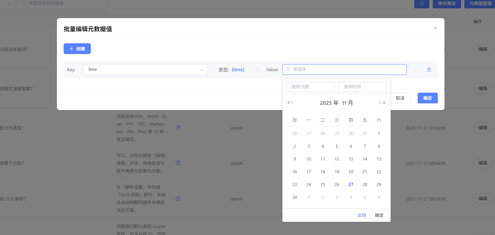
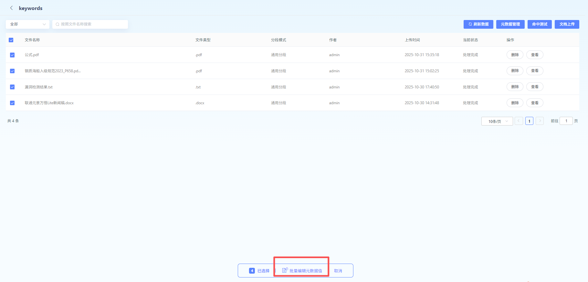
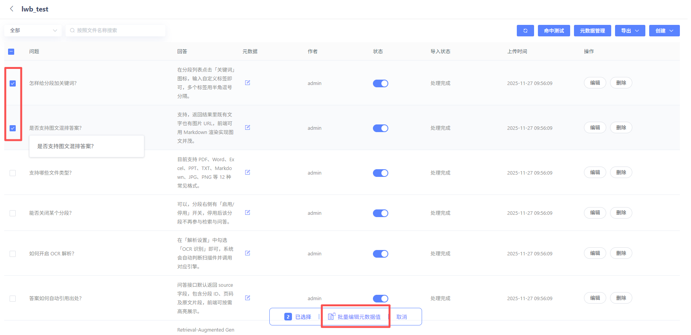

# 元数据管理

元数据是描述文档关键信息的“数据标签”。它不包含文档的具体内容，而是用来定义文档的属性，帮助您对文档进行结构化管理。

### 元数据管理

- **Key：**元数据字段是构成文档元数据的基本单元，它们为文档信息提供了标准化的分类和存储方式。通过定义和使用不同的字段，我们可以系统化地捕捉和管理文档的关键信息。
- **Type：**
  - **字符串**（String）：文本值。
  - **数字**（Number）：数值。
  - **时间**（Time）：日期和时间。

【知识库】

【问答库】

### 元数据值

**【知识库】**

在文件上传参数设置界面，支持对元数据进行设置。

- 下拉选择Key,可自动带出type。需先在 **知识库-元数据管理** 创建Key
  - 当用户上传压缩包文件时，type为string的key，可额外选择

- **Value：**该字段的具体信息或属性

  - value：填写具体的值
  - regExp：填写正则表达式

type为Time，则元数据value只能选择时间

type为number，则元数据value只能输入数字

type为string，则元数据value只能输入文字

type为string时，若用户上传的文件为压缩包，则会增加“按照文件夹名称自动识别”类型，识别效果如下：

- **文件路径：**压缩包名称\一级文件夹\二级文件夹\三级文件夹，用户创建key1、key2、key3三个元数据，自动识别“key1：一级文件夹、key2：二级文件夹、key3：三级文件夹”3个元数据标签

**【问答库】**

在“元数据列”点击编辑按钮

下拉选择Key,可自动带出type。需先在 **知识库-元数据管理** 创建Key。

type为number，则元数据value只能输入数字；

type为string，则元数据value只能输入文字；

type为Time，则元数据value只能选择时间。

### 元数据批量管理

用户可选中具体文档或问答对，批量编辑元数据value。

选中文档，点击“批量编辑元数据值”。

点击“创建元数据值”

应用于所有文档：若勾选,则自动为所有选定文档创建或编辑元数据值;否则仅对已具有对应元数据值的文档进行编辑。
