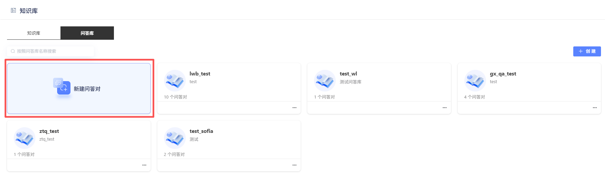
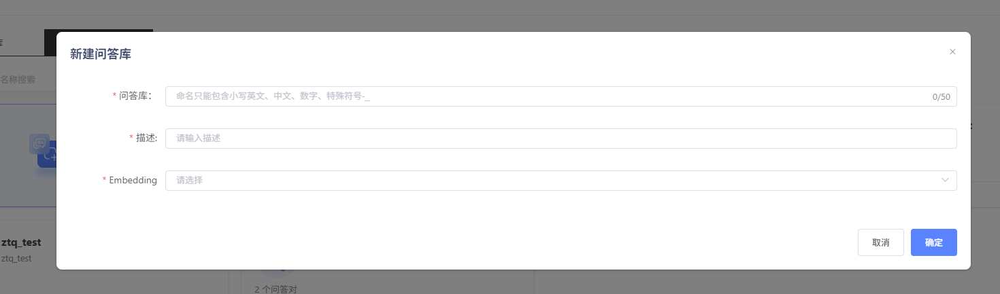
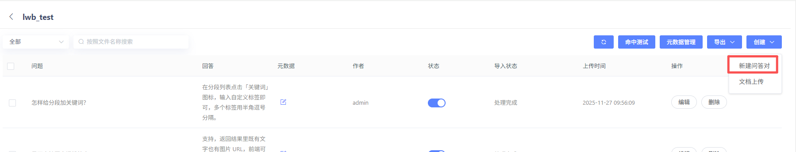
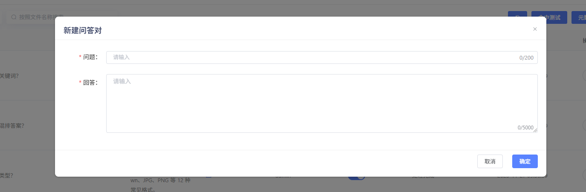
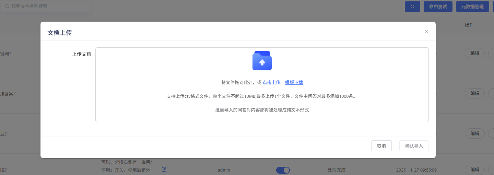

# 创建问答

## 新建问答库

创建问答库，关联Embedding模型。其中Embedding模型，需提前在模型管理模块上传。用户也可进行标签设置，方便进行问答库筛选分类。（已创建但未填写内容的标签，可通过Backspace键快捷删除）

## 创建问答对

支持用户手动添加问答对或通过模板上传问答对文件。

**【新建问答对】**

**【文档上传】**

支持用户通过csv批量上传问答对。批量导入的问答对内容都将被处理成纯文本形式。

