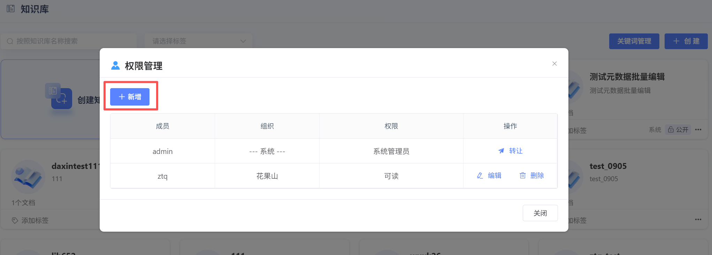
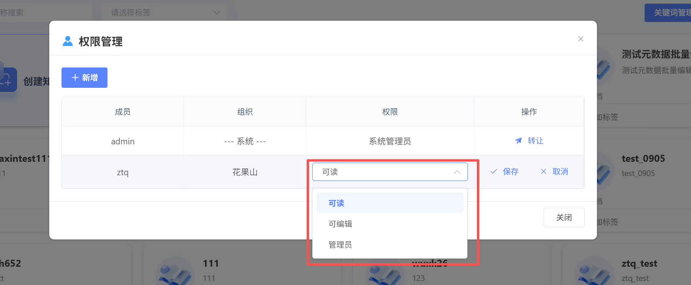
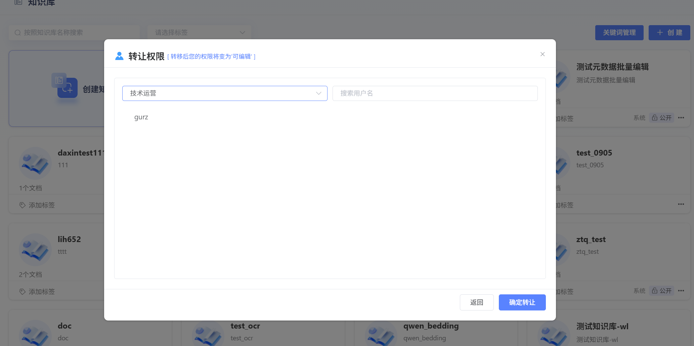

# 知识库权限

用户创建知识库后，可进行权限共享。具体权限如下：

### 知识库权限总览
| 权限项                                       | 系统管理员 | 子管理员         | 用户-可编辑 | 用户-可读  |
| :------------------------------------------- | :--------- | :--------------- | :---------- | :--------- |
| **数量限制**                                 | 唯一一个   | 可有多个         | 可有多个    | 可有多个   |
| **编辑/删除整个知识库**                      | ✅          | ❌                | ❌           | ❌          |
| **知识库权限管理**                           | ✅          | ✅                | ✅ (仅展示)  | ✅ (仅展示) |
| &nbsp;&nbsp;└ 搜索成员                       | ✅          | ✅                | ✅           | ✅          |
| &nbsp;&nbsp;└ 新增成员(可读/可编辑/子管理员) | ✅          | ✅                | -           | -          |
| &nbsp;&nbsp;└ 修改子管理员权限               | ✅          | ❌                | -           | -          |
| &nbsp;&nbsp;└ 修改用户权限                   | ✅          | ✅                | -           | -          |
| &nbsp;&nbsp;└ 编辑/删除用户                  | ✅          | ✅ (仅限普通用户) | -           | -          |
| &nbsp;&nbsp;└ 编辑/删除子管理员              | ✅          | ❌                | -           | -          |
| &nbsp;&nbsp;└ 转让管理员身份                 | ✅          | ❌                | -           | -          |
| **知识库操作权限**                           |            |                  |             |            |
| &nbsp;&nbsp;└ 刷新数据                       | ✅          | ✅                | ✅           | ✅          |
| &nbsp;&nbsp;└ 批量编辑元数据                 | ✅          | ✅                | ✅           | ❌          |
| &nbsp;&nbsp;└ 元数据管理                     | ✅          | ✅                | ✅           | ❌          |
| &nbsp;&nbsp;└ 命中测试                       | ✅          | ✅                | ✅           | ✅          |
| &nbsp;&nbsp;└ 上传文档                       | ✅          | ✅                | ✅           | ❌          |
| &nbsp;&nbsp;└ 查看文档                       | ✅          | ✅                | ✅           | ✅          |
| &nbsp;&nbsp;└ 删除文档                       | ✅          | ✅                | ✅           | ❌          |
| **文档内容操作**                             |            |                  |             |            |
| &nbsp;&nbsp;└ 查看分段                       | ✅          | ✅                | ✅           | ✅          |
| &nbsp;└ 编辑分段                             | ✅          | ✅                | ✅           | ❌          |
| &nbsp;&nbsp;└ 新增分段                       | ✅          | ✅                | ✅           | ❌          |
| &nbsp;&nbsp;└ 编辑元数据                     | ✅          | ✅                | ✅           | ❌          |
| &nbsp;&nbsp;└ 管理分段开关                   | ✅          | ✅                | ✅           | ❌          |
| &nbsp;&nbsp;└ 创建关键词                     | ✅          | ✅                | ✅           | ❌          |

### 权限操作

点击**“权限”**，可新增、编辑用户权限。

**1、新增用户权限：**

点击**“新增”**按钮，进行用户和权限配置

【选择用户】：系统管理员同级或子组织中没有权限的用户

【配置权限】：可读、可编辑、管理员

**2、编辑用户权限：**

点击**“编辑”**，可对现有用户权限进行更改。变更完成后，点击**“保存”**，保存新权限。

点击**“删除”**，可将该用户剔除知识库。

**3、系统管理员转让：**

一个知识库有且只有一个系统管理员，系统管理员可进行转让，转让后，原系统管理员的权限降级为**“可编辑”**。

【可选用户范围】：系统管理员同级或子组织中的所有用户

