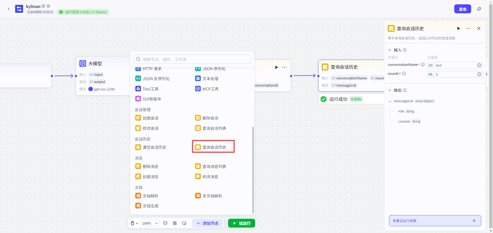
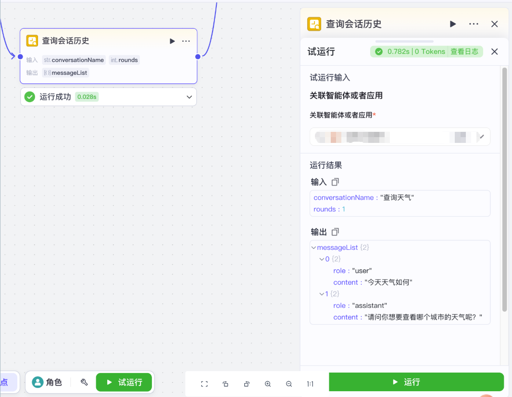

# 查询会话历史节点
#### 1. 功能简介
**“查询会话历史”节点**用于抓取指定会话中的聊天记录（即大模型可见的上下文信息）。
*   **它能做什么？** 帮助您获取某一次特定的“问答记录”。
*   **为什么要用它？** 获取历史上下文可以让大模型“回忆”起之前聊过的内容，从而结合当前指令生成更连贯、准确的回答。
---
#### 2. ⚠️ 说明
*   **数据结构（什么是“一轮”？）**：
    *   会话历史是由成对的消息组成的。
    *   **一轮对话（1 Round）** = **1个用户提问** + **1个模型回答**。
    *   查询时，您获取的是这种完整的问答对。
*   **查询范围**：每次查询只能获取**某一轮**具体的对话。

---
#### 3. 如何添加节点
1.  打开您的工作流画布。
2.  点击节点连接线上的 **“+”** 按钮。
3.  在左侧弹出的节点列表中，找到 **“会话历史”** 分类。
4.  选择 **“查询会话历史”** 节点，即可添加至画布。

---
#### 4. 节点配置
配置此节点的关键在于理解“轮次”的计数逻辑。
**输入配置**
| 参数名                              | 是否必填 | 类型   | 说明                                                         |
| :---------------------------------- | :------- | :----- | :----------------------------------------------------------- |
| `conversationName`（**会话名称** ） | 是       | 字符串 | 您要查询历史记录的目标会话名称。                             |
| `rounds`（**查询轮数**）            | 是       | 整数   | 指定要查询“倒数第几轮”对话。 **特别注意**： • **1** = 最新一轮对话（刚刚发生的）。 • **2** = 倒数第二轮对话。  |
> **💡 举例说明**：
> 如果当前会话共发生了 3 轮对话：
>
> *   输入 `rounds = 1`：获取第 3 轮的内容（最新）。
> *   输入 `rounds = 2`：获取第 2 轮的内容。

**输出结果**
节点执行成功后，会输出一个 `messageList` 列表，包含该轮对话的完整信息：

| 参数名    | 类型   | 说明                                                         |
| :-------- | :----- | :----------------------------------------------------------- |
| `role`    | 字符串 | 消息发送者的角色（如 `user` 代表用户，`assistant` 代表模型）。 |
| `content` | 字符串 | 消息的具体文本内容。                                         |
---
#### 5. 试运行与验证
*   **关联资源**：如果在资源库中试运行，系统要求您**关联一个具体的应用或智能体**，以确定查询的数据源。
*   **数据隔离**：
    *   **试运行时**：操作的是**草稿态临时数据**。
    *   **线上运行时**：操作的是真实的线上数据。

