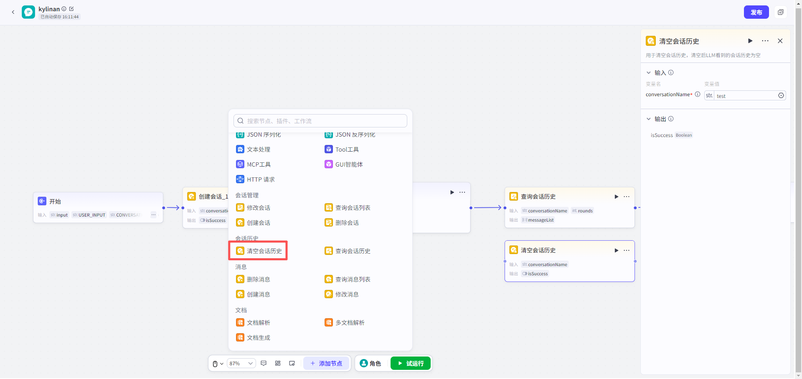
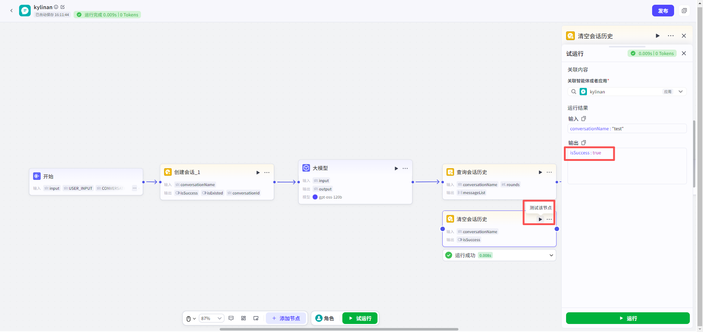

# 清空会话历史节点
#### 1. 功能简介
**“清空会话历史”节点**用于“重置”大模型的记忆。它不会删除会话本身，而是清除会话中**模型可见的上下文信息**。
*   **核心作用**：当对话进入新话题，且不希望之前的聊天内容影响当前的回答时，使用此节点。执行成功后，大模型将“忘记”之前的对话，像第一次聊天一样响应后续指令。
---
#### 2. 典型应用场景
**场景：话题切换与去干扰**
在多轮对话中，历史上下文虽然有助于保持连贯，但也可能成为“包袱”，导致模型无法正确识别用户新的意图。
> **示例对话：**
>
> **阶段一：旧话题（北京旅游）**
> *   用户：我在北京旅游，推荐点好吃的。
> *   模型：北京烤鸭和炸酱面是必尝的美食！
> *   用户：如果不考虑北京呢？
> *   模型：那可以尝尝天津的狗不理包子，或者去河北吃驴肉火烧。（受“北京/北方”地理位置的上下文影响，推荐仍局限在周边）。
>
> **【执行：清空会话历史节点】** 👈 *在此处切断记忆，让模型跳出“北京”的设定*
>
> **阶段二：新话题（全球美食）**
> *   用户：如果不考虑北京呢？
> *   模型：如果不限制地区，推荐您尝试法国的法餐、日本的寿司或者泰国的冬阴功汤。（不再受地理位置限制，给出了全球视野的推荐）
---
#### 3. ⚠️ 重要说明与限制
配置前，请务必理解以下关键逻辑：
*   **📝 清空 ≠ 删除**：
    *   此节点仅**清除模型的记忆（上下文）**，后续对话不再受之前内容影响。
    *   **不会物理删除**数据库中的历史消息。您仍然可以通过“查询消息列表”节点查看到完整的聊天记录。
*   **🧪 试运行安全**：
    *   试运行时，只能清除应用中的**测试数据（草稿态）上下文**，无法清除线上真实环境的上下文。
---
#### 4. 节点配置
配置非常简单，只需指定目标会话。
**输入配置**
| 参数名                         | 是否必填 | 类型   | 说明                                                         |
| :----------------------------- | :------- | :----- | :----------------------------------------------------------- |
| `conversationName`（会话名称） | 是       | 字符串 | 需要重置记忆的目标会话名称。支持输入固定值或引用上游节点输出。 |

**输出结果**

| 参数名      | 类型   | 说明                       |      |
| :---------- | :----- | :------------------------- | :--- |
| `isSuccess` | 布尔值 | 表示清空操作是否执行成功。 |      |

---
#### 5. 试运行与验证
*   **关联资源**：在资源库中试运行时，必须**关联一个具体的应用**。

