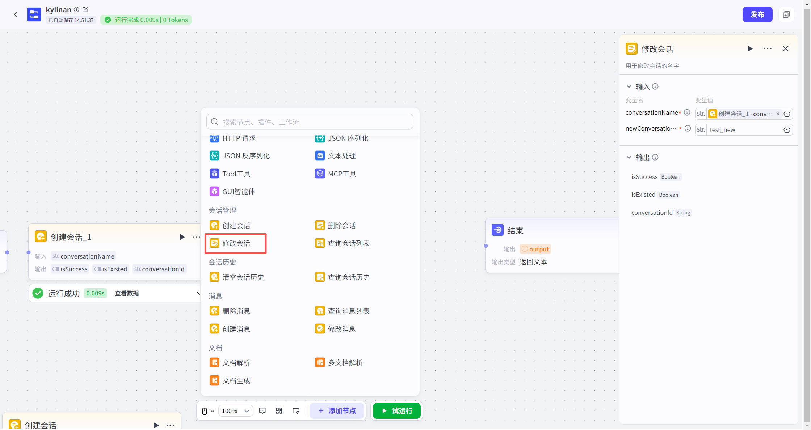
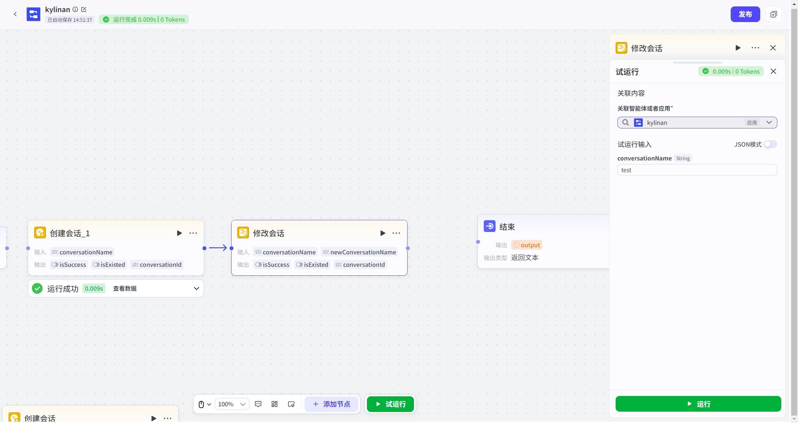
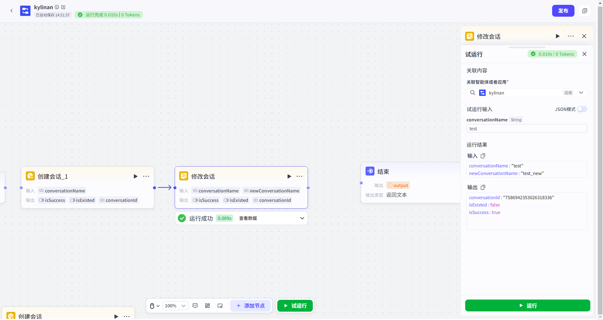

# 修改会话节点
#### 1. 功能简介
**“修改会话”节点**用于在工作流中更改现有会话的名称。
*   **它能改什么？** 仅修改会话的**显示名称**。
*   **它不会改什么？** 不会改变会话的 **ID**（唯一标识符），也不会影响或删除会话中已有的任何聊天记录。
*   **适用对象**：通常用于修改通过“创建会话节点”动态生成的会话名称。
---
#### 2. 如何添加节点
1.  打开您的工作流画布。
2.  点击节点连接线上的 **“+”** 按钮。
3.  在左侧弹出的节点列表中，找到 **“会话管理”** 分类。
4.  选择 **“修改会话”** 节点，即可添加至画布。



---
#### 3. 节点配置
此节点的核心逻辑是“找到旧名字，替换为新名字”。
**输入配置**
| 参数名                              | 是否必填 | 类型   | 说明                                                         |
| :---------------------------------- | :------- | :----- | :----------------------------------------------------------- |
| `conversationName`（会话名称）      | 是       | 字符串 | 当前要修改的目标会话名称（旧名字）。                         |
| `newConversationName`（新会话名称） | 是       | 字符串 | 您希望设置的新名称。**注意：在同一个应用中，会话名称必须唯一。** |
> **💡 提示**：参数值可以输入固定字符串，也可以引用上游节点的输出或变量，实现动态命名（例如在原名称后加上日期）。


**输出结果**

| 参数名           | 类型   | 说明                                                         |
| :--------------- | :----- | :----------------------------------------------------------- |
| `isSuccess`      | 布尔值 | 表示修改操作是否执行成功。                                   |
| `isExisted`      | 布尔值 | 表示应用中是否**已存在**目标新名称。如果为 `true`，说明修改失败（重名）。 |
| `conversationId` | 字符串 | 会话的唯一 ID。无论名称是否修改成功，ID 都不会变。           |
*   **场景一：修改成功（无重名）**
    
    ```json
    conversationId : "7586942353026318336"
    isExisted : false
    isSuccess : true
    ```
    *(解释：新名字可用，修改成功，返回原会话ID)*
*   **场景二：修改失败（名称冲突）**
    ```json
    conversationId : "7586942353026318336"
    isSuccess : false
    isExisted : true
    ```
    *(解释：新名字已经被其他会话占用，修改未生效)*

---
#### 4. 试运行与验证
在正式发布前，建议进行试运行以确保命名逻辑无误。
*   **关联应用**：如果在资源库中直接试运行，系统会要求您**关联一个具体的应用**，因为会话是归属于应用的。
*   **数据隔离（安全机制）**：
    *   **试运行时**：节点操作的是**草稿态临时数据**。您可以随意修改名称进行测试，不会影响线上环境。
    *   **线上运行时**：节点操作的是真实的线上数据。



