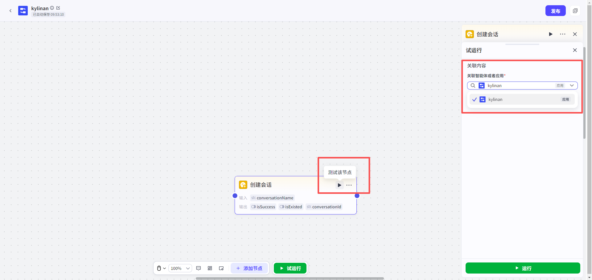
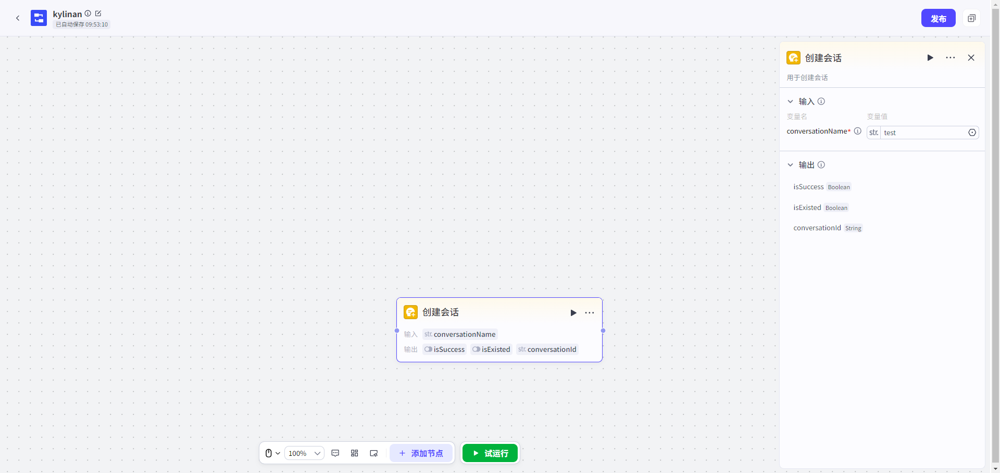
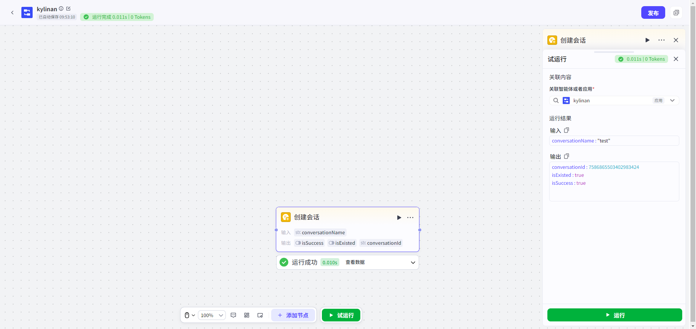

# 创建会话节点

## 节点概述
#### 1. 什么是“会话”和“创建会话节点”？
*   **会话**：您可以把它想象成一个**独立的聊天记录容器**。它专门用来存放用户和AI模型之间围绕一个主题的所有对话消息。
*   **创建会话节点**：这是一个功能模块，让您在自动化流程（如工作流或对话流）中，能够**动态地、按需创建一个全新的、空的聊天记录容器**。
---
#### 2. 为什么要使用“创建会话”节点？
在标准的对话流中，通常会绑定一个固定的“默认会话”。但在一些复杂的业务场景下，您可能需要为每个用户、每个任务或每个订单创建一个独立的对话空间。
**典型场景：**

> 假设您正在构建一个智能客服系统。每当有新用户发起咨询时，系统会自动通过“创建会话”节点，为这位用户生成一个专属的聊天记录。这样，不同用户的对话内容就不会互相干扰，便于独立管理和追溯。
> 简单来说，当您需要**在流程运行时，为不同情况生成独立的对话空间**时，就需要用到这个节点。
---
#### 3. 如何配置“创建会话”节点？
配置非常简单，您只需要设置输入，然后查看输出结果。


| 输入参数                     | 是否必填 | 类型   | 说明                                                         |
| :--------------------------- | :------- | :----- | :----------------------------------------------------------- |
| conversationName（会话名称） | 是       | 字符串 | 为新创建的会话起一个名字。**注意：在同一个应用中，会话名称必须是唯一的。** 您可以直接输入固定名称，也可以引用上游节点的数据（如用户ID）。 |
| 输出参数         | 类型   | 说明                                                    |      |
| `isSuccess`      | 布尔值 | `true` 表示操作成功。                                   |      |
| `isExisted`      | 布尔值 | `true` 表示应用中已存在同名会话，本次操作未创建新会话。 |      |
| `conversationId` | 字符串 | 会话的唯一ID。如果会话已存在，则返回原有会话的ID。      |      |

点击“测试该节点”，关联应用，再点击“运行”，即可生成对应的输出参数，获取conversationId







* **成功创建新会话：**

  ```
  conversationId: 7586865503402983424
  isSuccess: true
  isExisted: false
  ```

* **会话已存在，返回旧会话ID：**

  ```
  conversationId: 7586865503402983424
  isSuccess: true
  isExisted: true
  ```

