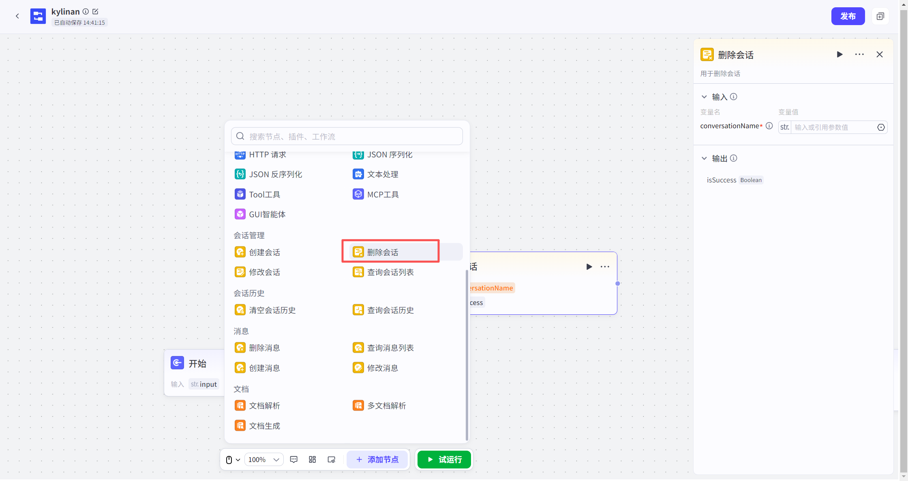
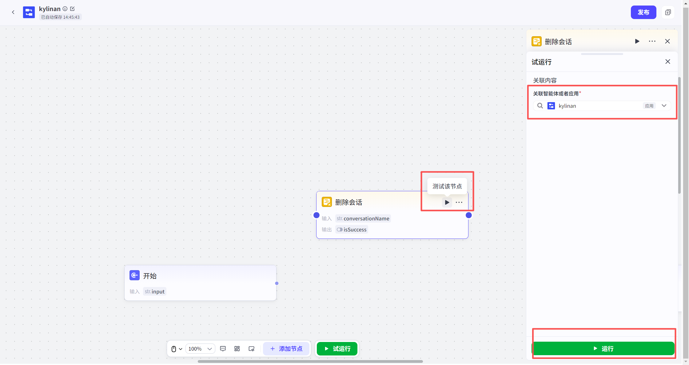
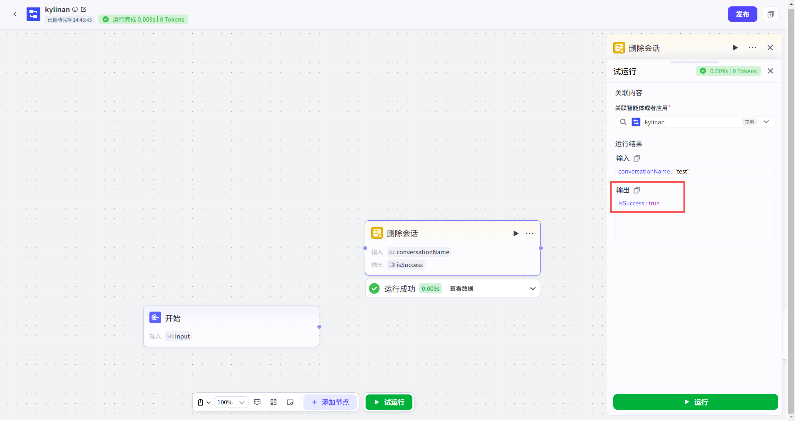

# 删除会话节点

#### 1. 功能简介与业务价值
**“删除会话”节点**用于在工作流中**永久删除**指定名称的会话及其包含的所有历史消息。
**为什么需要它？**
系统对每个用户的会话数量设有**上限（200个）**。当用户的会话数量达到上限后，将无法再创建新会话，导致业务报错。因此，在创建新会话之前，通常建议使用该节点清理过期的历史会话，以释放存储空间。

> **⚠️ 高风险警告：**
> 删除操作是不可逆的！一旦执行，会话及其内部的所有聊天记录都将被**永久清除**，无法恢复。请在配置逻辑时务必谨慎，确保筛选条件的准确性。
---
#### 2. 如何添加节点
1.  打开您的工作流画布。
2.  点击节点连接线上的 **“+”** 按钮。
3.  在左侧弹出的节点列表中，找到 **“会话管理”** 分类。
4.  选择 **“删除会话”** 节点，即可添加至画布。

---
#### 3. 节点配置
配置此节点时，核心是指定“要删谁”。
**输入配置**

| 参数名                              | 是否必填 | 类型   | 说明                                                         |
| :---------------------------------- | :------- | :----- | :----------------------------------------------------------- |
| `conversationName`（**会话名称** ） | 是       | 字符串 | 指定要删除的那个会话的名字。您可以直接输入固定名称，或引用上游节点输出/变量来动态决定要删除的会话。 |
| **输出结果** |        |                            |      |
| 参数名       | 类型   | 说明                       |      |
| `isSuccess`  | 布尔值 | 表示删除操作是否执行成功。 |      |

---
#### 4. 试运行与验证
在正式发布前，请务必通过试运行来验证删除逻辑是否正确。
*   **关联应用**：如果在资源库中直接试运行，系统会要求您**关联一个具体的应用**，因为删除操作必须在特定应用的上下文中进行。
*   **数据隔离（安全机制）**：
    *   **试运行时**：节点操作的是**草稿态临时数据**。这意味着您可以放心测试，不会误删线上真实用户的会话。
    *   **线上运行时**：节点操作的是真实的线上数据。

