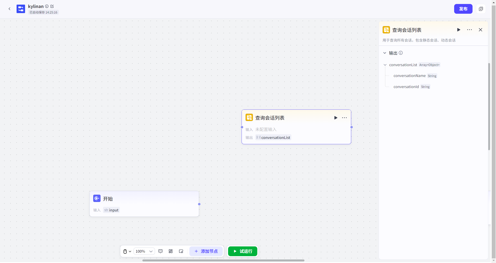
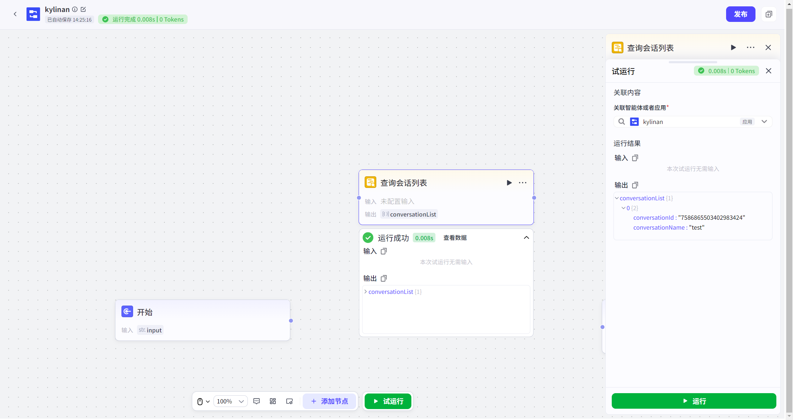

# 查询会话列表节点
#### 1. 功能简介
**“查询会话列表”节点**可以帮助您在工作流中，获取**当前终端用户**的所有会话记录。

*   **它能做什么？** 它会列出该用户名下的所有会话，无论是长期存在的**静态会话**，还是临时生成的**动态会话**。
*   **为什么要用它？** 当您的流程需要对某个特定会话进行操作（如发送消息、修改属性或删除会话）时，必须先知道它的名称或ID。通过这个节点，您可以先“查”出列表，再通过筛选条件，找到目标会话供后续节点使用。
---
#### 2. 使用限制
请注意，这是一个**应用级**功能节点：
*   ✅ **适用场景**：仅可在“应用”内的低代码工作流或对话流中使用。
*   ❌ **暂不支持**：低代码智能体项目目前暂不支持使用此类会话管理节点。
---
#### 3. 如何添加节点
1.  打开您的低代码工作流画布。
2.  点击节点连接线上的 **“+”** 按钮。
3.  在左侧弹出的节点列表中，找到 **“会话管理”** 分类。
4.  选择 **“查看会话列表”** 节点，即可添加至画布。
---
#### 4. 节点配置
配置该节点非常简单，无需复杂的参数设置。

**输入配置**

*   **无需配置**：该节点默认自动获取当前操作用户（终端用户）的所有会话数据，无需手动指定任何输入参数。

**输出结果**
节点执行成功后，会输出一个 `conversationList` 列表，其中包含每个会话的关键信息：

| 参数名             | 类型   | 说明                                                 |
| :----------------- | :----- | :--------------------------------------------------- |
| `conversationId`   | String | 会话的唯一标识ID（后续操作会话时通常需要用到此ID）。 |
| `conversationName` | String | 会话的名称。                                         |
---
#### 5. 试运行与验证
为了确保逻辑正确，您可以在资源库中对工作流进行试运行。
*   **关联应用**：如果在资源库中直接试运行，系统会要求您**关联一个具体的应用**，因为会话数据是归属于应用的。
*   **数据隔离（安全提示）**：
    *   试运行时，节点操作的是**草稿态临时数据**（即应用中的临时会话）。
    *   只有当工作流正式**发布并线上运行**时，操作才是真实的线上用户数据。
    *   **两者完全隔离**，试运行不会影响真实用户。

