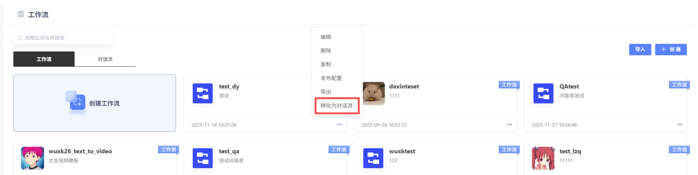
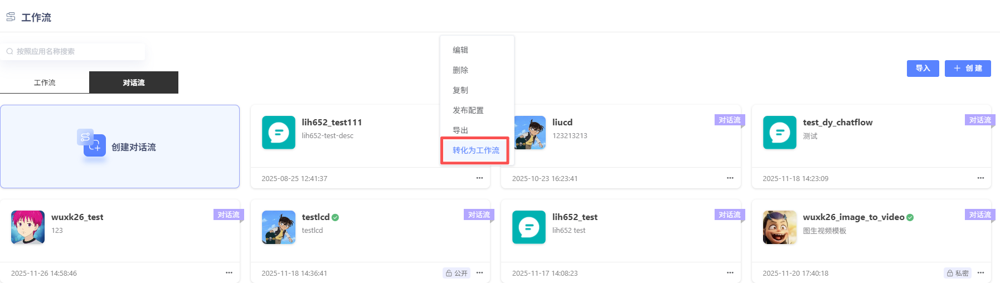

# 工作流与对话流

### 一、 什么是工作流？
想象一下，你不再只是给 AI 一个指令，然后等待一个回答。而是像一位导演，为 AI 设计好了一整套精密的、自动化的行动方案——从理解意图、调用工具、处理数据，到最终生成完美的结果。
它是一系列**可视化、可执行的指令集合**，一个为你的智能体打造的**结构化框架**。工作流的核心魅力在于，它将大模型的强大认知能力，与你独特的业务逻辑和创意流程无缝融合，让你能够**系统化、流程化地构建出高效、可扩展的 AI 应用**。

### 二、 两种核心模式：工作流 vs. 对话流
为了应对不同的应用场景，提供了两种强大的工作流模式。选择哪一种，取决于你希望你的智能体如何与世界互动。
| 模式         | **工作流**                                                   | **对话流**                                                   |
| :----------- | :----------------------------------------------------------- | :----------------------------------------------------------- |
| **核心定位** | **功能执行器**                                               | **对话交互引擎**                                             |
| **最佳比喻** | 一条**自动化生产线**                                         | 一位**智能对话伙伴**                                         |
| **适用场景** | - **自动化数据处理**：生成行业调研报告、批量制作海报、自动化绘本创作。 - **后台任务执行**：定时同步数据、处理用户提交的表单。 - **无交互的复杂任务**：任何不需要与用户来回对话，只需“一键完成”的功能。 | - **智能客服**：理解用户咨询，在知识库中查找答案，或转接人工。 - **个人助手**：通过多轮对话，帮你预订机票、安排日程、查询信息。 - **虚拟伴侣/角色扮演**：进行有记忆、有情感、有剧情的深度互动。 |
| **交互方式** | 顺序执行，一次性完成任务。                                   | 基于对话，与用户进行多轮交互，逐步完成任务。                 |

*   **简单决策**：
*   想做一个**“工具”**？用 **工作流**。
*   想做一个**“聊天机器人”**？用 **对话流**。

| 差异维度          | **工作流**                                                   | **对话流**                                                   |
| :---------------- | :----------------------------------------------------------- | :----------------------------------------------------------- |
| **1. 核心定位**   | **功能执行器** 像一个自动化脚本，专注于“完成任务”。       | **对话交互引擎** 像一个聊天机器人，专注于“进行对话”。     |
| **2. 记忆能力**   | **无原生记忆** 每次执行都是独立的，不保留历史对话。大模型节点默认无法读取上下文。 | **内置会话记忆** 绑定一个会话，能自动记录和读取历史消息，实现连贯的多轮对话。 |
| **3. 角色与人格** | **不支持** 它是一个纯粹的功能执行者，没有人设。           | **支持** 可以为每个对话流配置独特的角色名称、头像、开场白等，打造有“人设”的AI。 |
| **4. 用户界面**   | **灵活多样** 支持布局组件、展示组件等丰富的UI组件，可以构建复杂的网页或移动端界面。 | **专注对话** 目前主要支持 **AI对话组件**，将流程包装成一个聊天面板，提供纯粹的对话体验。 |
####  API 调用差异
对于开发者而言，调用方式也有所不同：
*   **调用工作流**：使用[工作流接口](https://github.com/UnicomAI/wanwu/blob/main/configs/microservice/bff-service/static/manual/wanwu-openapi/3.%E5%B7%A5%E4%BD%9C%E6%B5%81API.md)。
*   **调用对话流**：使用[对话流接口]()。
---
### 三、 工作流的基石：节点
如果说工作流是蓝图，那么**节点**就是构成这张蓝图的每一个功能模块。每个节点都是一个独立的、拥有特定能力的组件，它们是工作流世界里的“乐高积木”。
* **输入与输出**：每个节点都像一台微型机器，有“原料入口”（输入）和“成品出口”（输出）。

* **连接与流动**：通过将一个节点的**输出**，连接到另一个节点的**输入**，你就构建起了一条**数据流动的通道**。数据就像水流一样，在这条通道上从一个节点流向下一个节点，每经过一个节点，就被处理或加工一次。

  

* **核心节点角色**：

* **开始节点**：整个工作流的起点，定义了启动这个“生产线”需要哪些“原料”（输入参数）。

*   **结束节点**：工作流的终点，负责将最终的“成品”（运行结果）返回给你。
**示例**：
你可以将**大模型节点**的输出（一段生成的文本），连接到**代码节点**的输入。这样，代码节点就能接收这段文本，并对其进行格式化、翻译或任何你需要的处理。在画布上，这条清晰的连线就代表了一个完整的数据处理步骤。
---
### 四、 灵活性与扩展性：强类型变量的力量
为了让你能像专业开发者一样构建复杂的应用，工作流在底层提供了强大的**类型系统**。
* **丰富的数据类型**：核心节点支持多种变量类型，包括 `String` (文本)、`Integer` (整数)、`Number` (数字)、`Boolean` (布尔值)、`Object` (对象)、`File` (文件) 和 `Array` (数组) 等。

* **无需手动转换**：这意味着你可以在不同的节点间，直接传递复杂的数据结构（如一个包含用户信息的对象），而无需在中间进行繁琐的数据格式转换。

  

* **这为你带来了什么？**

* **更高的灵活性**：你可以根据业务需求，自由选择最合适的数据类型来构建逻辑。

*   **更强的扩展性**：你的工作流可以轻松处理来自数据库、API 或其他系统的复杂数据，为构建企业级应用打下坚实基础。

*   翻译或任何你需要的处理。在画布上，这条清晰的连线就代表了一个完整的数据处理步骤。

---

### 五、工作流/对话流的创建及发布

#### 1、工作流与对话流创建

点击“创建工作流”即可进入工作流创建界面。用户可自行设定工作流名称、工作流描述描述。平台内置了标准工作流示例，用户也可直接复制使用。

#### 2、工作流与对话流编辑

平台提供MCP、意图识别、API、代码、大模型、分支器、知识库、文档生成、文档解析等节点。

#### 3、工作流与对话流调试与发布

编辑完毕的工作流，点击“调试”，运行成功后，即可进行发布。点击“发布”可进行发布方式选择，用户可进行私密发布，也可进行公开发布。发布完成的工作流可作为工具，被智能体调用。支持发布为API。

**私密发布：**发布后仅对自己可见。

**公开发布：**发布后可对全部用户进行共享。

已发布的工作流与对话流也可取消发布后，重新进行编辑。并可进行发布配置，创建OpenAPI。

#### 4、工作流与对话流导入导出

支持工作流与对话流导入导出。

#### 5、工作流、对话流相互转换

支持对话流及工作流之间相互转换。

