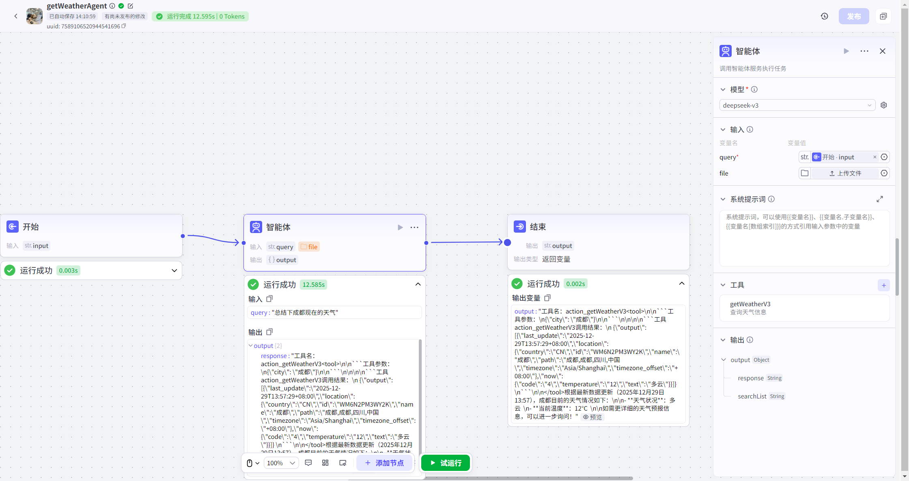
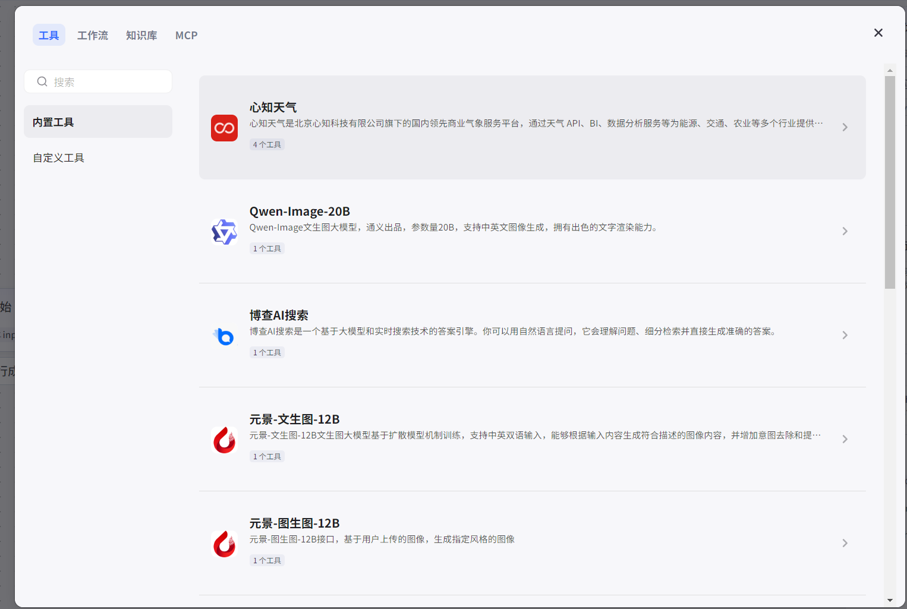
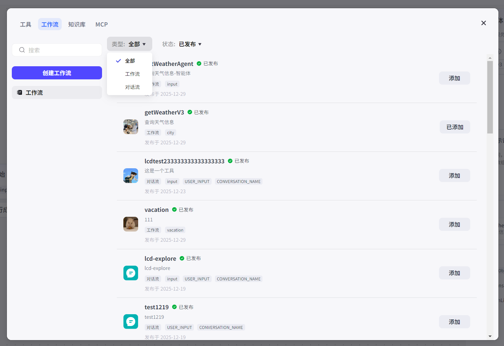
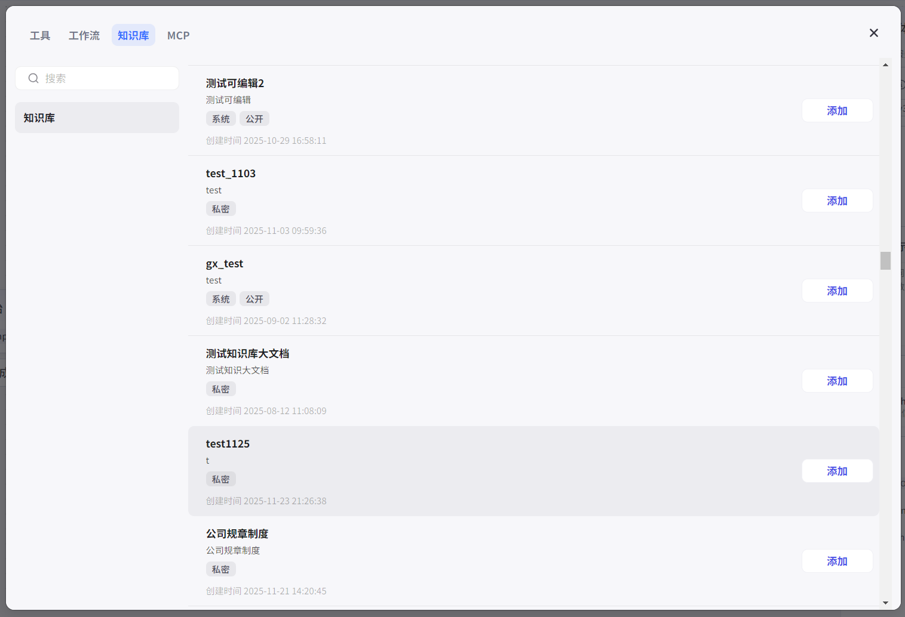
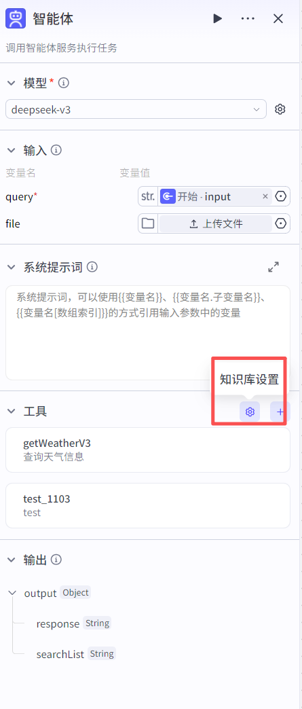
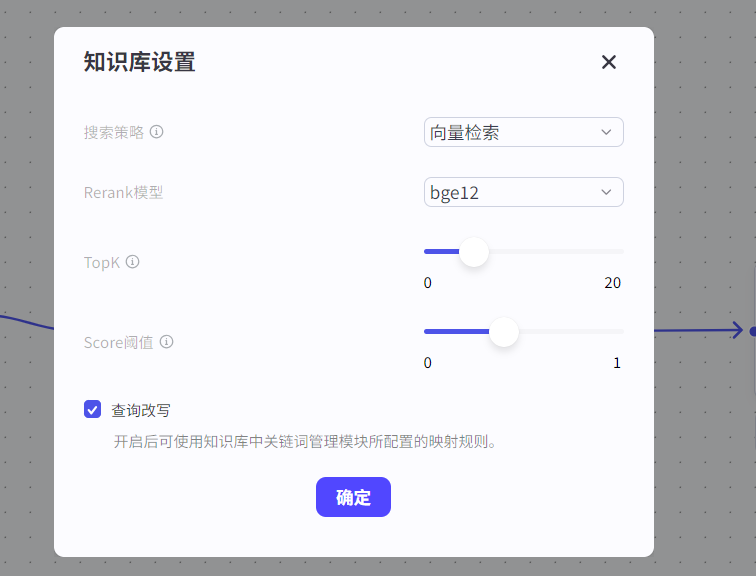
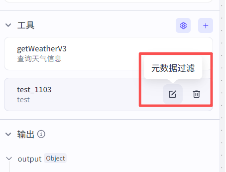
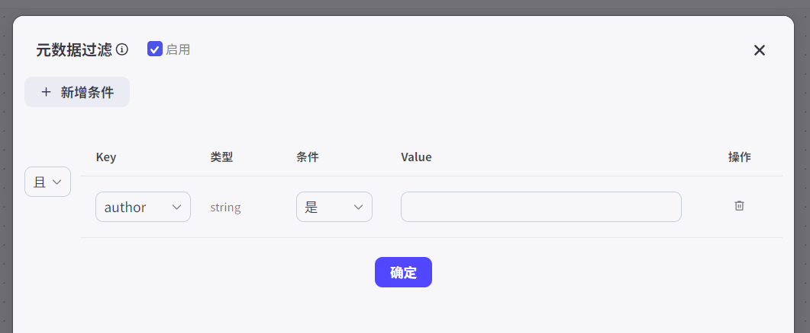
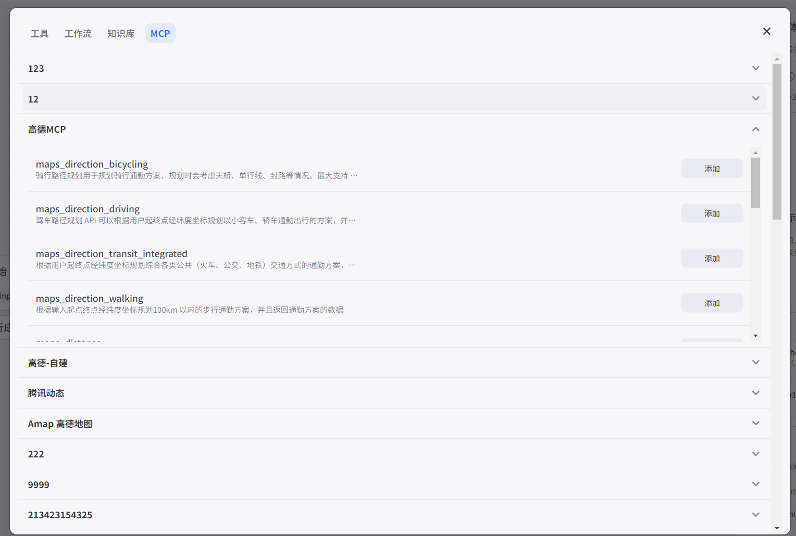

# 智能体节点

## 节点概述

**核心功能**：它允许你在一个工作流（主流程）中，嵌入一个智能体，实现“工作流调用智能体”的强大功能。

## 配置指南

##### 1、选择模型

* **如何操作**：在节点配置区的“模型”下拉菜单中，选择一个大型语言模型。模型导入方式详见[模型导入方式-详细版](../模型导入方式-详细版.md)

* 支持用户选择所有已导入平台的大模型并进行参数配置。

* **建议**：

  *   **按需选择**：没有“最好”的模型，只有“最合适”的模型。对于简单的文本润色，基础模型即可胜任；对于复杂的逻辑推理或代码生成，则需要选择更高级的模型。

##### 2、输入

- **query（必填）：**用户输入问题。
- **file（非必填）：**用户可上传文档，进行文档内容解析及问答。

##### 3、配置系统提示词

*   **作用**：定义模型的**核心人设、角色和基本原则**。它为模型设定了一个宏观的框架，影响其所有后续的思考和回答。
*   **如何编写**：
    *   **明确角色**：直接告诉模型“你是一个XX”。例如：“你是一位专业的科技博主。”
    *   **定义任务**：清晰地说明它的核心职责。例如：“你的任务是将复杂的技术概念，用通俗易懂的语言解释给普通读者。”
    *   **设定风格**：规定回复的语言风格。例如：“你的语言风格应该风趣幽默，可以适当使用网络流行语。”
    *   **规定限制**：明确不能做什么。例如：“不要使用任何专业术语，不要生成超过200字的回复。”

##### 4、配置工具

- 工具：关联内置工具及自定义工具。

- 工作流：关联已发布的工作流和对话流（最新版本）。

- 知识库：关联知识库。可进行元数据过滤配置、知识库检索方式配置。

  

  

  

  

  

- **MCP：**可关联MCP。

