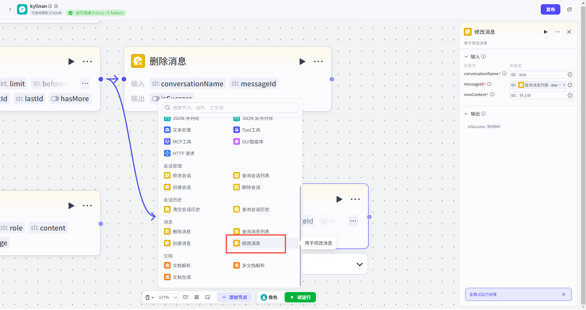
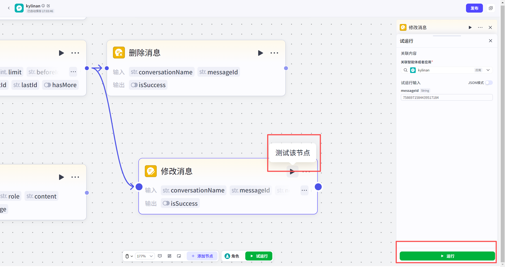

# 修改消息节点
#### 1. 功能简介
**“修改消息”节点**用于编辑指定会话中**某一条**已存在的消息内容。
*   **核心作用**：更正对话中的错误信息，或更新特定的回复内容。
*   **同步更新**：修改完成后，会话存储的消息内容以及**模型可见的上下文历史**都会同步更新。这意味着模型在后续对话中，将把这条消息视为新内容进行处理。
---
#### 2. ⚠️ 重要逻辑说明
*   **精准定位**：每次执行只能修改 **1条** 消息，必须通过唯一的 **Message ID** 进行定位。
*   **如何获取 Message ID？**
    *   由于 Message ID 是系统自动生成的，您通常需要先使用 **“查询消息列表节点”**，从返回的列表中找到目标消息的 `messageId`，再将其作为输入传给本节点。
*   **内容限制**：目前仅支持修改 **文本类型** 的消息内容。暂不支持直接修改为图片、视频等多模态内容。
---
#### 3. 如何添加节点
1.  打开您的工作流画布。
2.  点击节点连接线上的 **“+”** 按钮。
3.  在左侧弹出的节点列表中，找到 **“消息”** 分类。
4.  选择 **“修改消息”** 节点，即可添加至画布。

---
#### 4. 节点配置
配置此节点的关键在于提供准确的 ID 和正确的新内容。
**输入配置**
| 参数名                              | 是否必填 | 类型   | 说明                                                         |
| :---------------------------------- | :------- | :----- | :----------------------------------------------------------- |
| `conversationName`（**会话名称** ） | 是       | 字符串 | 目标消息所在的会话名称。                                     |
| `messageId`（**消息 ID** ）         | 是       | 字符串 | 待修改消息的唯一标识 ID。 💡 **建议**：引用上游“查询消息列表”节点的输出参数 `messageList.messageId`。 |
| `newContent`（**新内容** ）         | 是       | 字符串 | 您想要替换的新文本内容。 • **注意**：仅支持纯文本，暂不支持多模态内容。 |
**输出结果**

| 参数名      | 类型   | 说明                       |      |
| :---------- | :----- | :------------------------- | :--- |
| `isSuccess` | 布尔值 | 表示修改操作是否执行成功。 |      |

---

#### 5. 试运行与验证

*   **关联资源**：在资源库中试运行时，必须**关联一个具体的应用**。
*   **数据范围**：支持对**动态会话**或**静态会话**中的消息进行修改。

