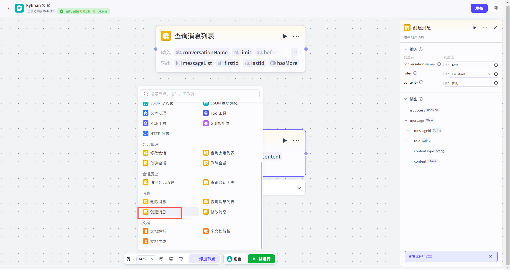
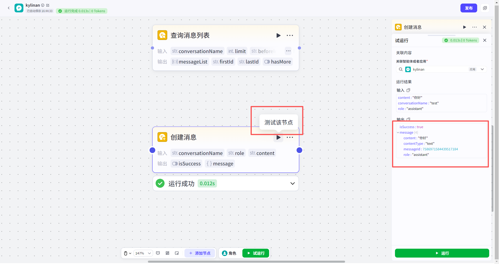

# 创建消息节点
#### 1. 功能简介
**“创建消息”节点**用于在指定会话中**手动写入**一条消息。
*   **核心用途**：除了用户和模型的自然对话外，您可以使用此节点主动向会话中插入内容。这些插入的消息会成为会话历史（上下文）的一部分，供模型在后续对话中参考。
*   **适用范围**：支持向**动态会话**或**静态会话**中插入消息。
---
#### 2. 使用建议与限制
*   **单次插入**：每次执行该节点，只能插入 **1条** 消息。
*   **角色交替**：为了保持模型的逻辑连贯，建议遵循“一问一答”的顺序交叉插入消息。
    *   *推荐顺序*：用户消息 -> 模型回复 -> 用户消息 -> 模型回复...
*   **内容限制**：
    *   目前仅支持插入**文本类型**（Text）的消息。
    *   **暂不支持**直接上传图片、视频、音频等文件。
    *   *变通方法*：如果需要展示多媒体，可以将图片或视频的 **URL 链接** 以文本形式写入消息内容中。
---
#### 3. 如何添加节点
1.  打开您的工作流画布。
2.  点击节点连接线上的 **“+”** 按钮。
3.  在左侧弹出的节点列表中，找到 **“消息”** 分类。
4.  选择 **“创建消息”** 节点，即可添加至画布。

---
#### 4. 节点配置
配置此节点时，需要明确消息的归属者和具体内容。
**输入配置**

| 参数名                              | 是否必填 | 类型   | 说明                                                         |
| :---------------------------------- | :------- | :----- | :----------------------------------------------------------- |
| `conversationName`（**会话名称** ） | 是       | 字符串 | 目标会话的名称。                                             |
| `role`（**角色** ）                 | 是       | 字符串 | 定义这条消息是谁发出的。 • **`user`**：代表用户发出的消息。 • **`assistant`**：代表模型（智能体）回复的消息。 |
| `content`（**内容** ）              | 是       | 字符串 | 消息的具体文本内容。 • 仅支持纯文本。 • 可以在文本中包含图片、视频等资源的 URL 链接。 |
**输出结果**

节点执行成功后，会返回新创建的消息详情：

| 参数名                | 类型   | 说明                                 |      |
| :-------------------- | :----- | :----------------------------------- | :--- |
| `isSuccess`           | 布尔值 | 表示插入操作是否执行成功。           |      |
| `message`             | 对象   | 新消息的详细对象（仅在成功时返回）。 |      |
| `message.messageId`   | 字符串 | 新消息的唯一 ID。                    |      |
| `message.role`        | 字符串 | 新消息的角色（user 或 assistant）。  |      |
| `message.contentType` | 字符串 | 消息类型，目前固定为 **`text`**。    |      |
| `message.content`     | 字符串 | 新消息的完整文本内容。               |      |

---
#### 5. 试运行与验证
*   **关联资源**：在资源库中试运行时，必须**关联一个具体的应用**。

