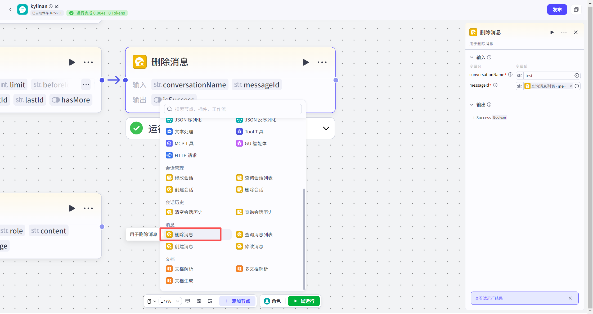
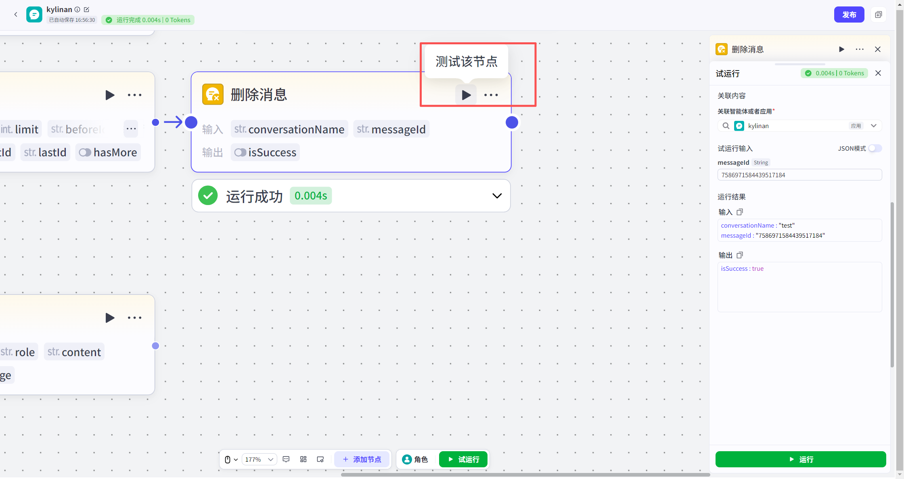

# 删除消息节点
#### 1. 功能简介
**“删除消息”节点**用于精准移除指定会话中的**某一条**特定消息。
*   **核心作用**：不仅仅是隐藏消息，而是将其从存储的历史记录中彻底删除。
*   **对模型的影响**：删除后，模型在后续对话中将不再能看到这条消息，它不会再影响模型的回答逻辑（即从上下文中移除）。
*   **典型场景**：纠正错误的对话记录、移除敏感信息或清理干扰模型判断的无效消息。
---
#### 2. ⚠️ 重要逻辑说明
*   **精准定位**：每次执行只能删除 **1条** 消息，且必须通过唯一的 **Message ID** 进行定位。
*   **如何获取 Message ID？**
    *   由于 Message ID 是系统自动生成的长字符串，用户通常无法直接预知。
    *   **标准流程**：您通常需要先使用 **“查询消息列表节点”**，获取到消息列表后，从中提取目标消息的 `messageId`，再将其作为输入传给“删除消息节点”。
*   **不可恢复**：消息一旦删除，通常无法恢复，请谨慎操作。
---
#### 3. 如何添加节点
1.  打开您的低代码工作流画布。
2.  点击节点连接线上的 **“+”** 按钮。
3.  在左侧弹出的节点列表中，找到 **“消息”** 分类。
4.  选择 **“删除消息”** 节点，即可添加至画布。

---
#### 4. 节点配置
配置此节点的关键在于准确传入从上游获取的 ID。

**输入配置**

| 参数名                              | 是否必填 | 类型   | 说明                                                         |
| :---------------------------------- | :------- | :----- | :----------------------------------------------------------- |
| `conversationName`（**会话名称** ） | 是       | 字符串 | 目标消息所在的会话名称。                                     |
| `messageId`（**消息 ID** ）         | 是       | 字符串 | 待删除消息的唯一标识 ID。 💡 **建议**：引用上游“查询消息列表”节点的输出参数 `messageList.messageId`。 |
输出结果

| 参数名      | 类型   | 说明                       |      |
| :---------- | :----- | :------------------------- | :--- |
| `isSuccess` | 布尔值 | 表示删除操作是否执行成功。 |      |

---
#### 5. 试运行与验证
*   **关联资源**：在资源库中试运行时，必须**关联一个具体的应用**。
*   **数据范围**：支持对**动态会话**或**静态会话**中的消息进行删除操作。

