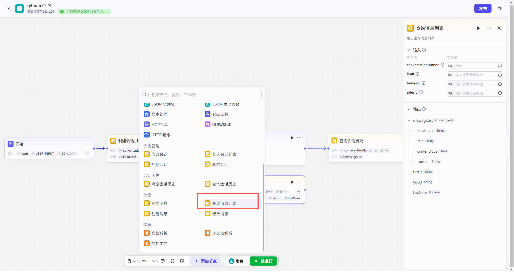
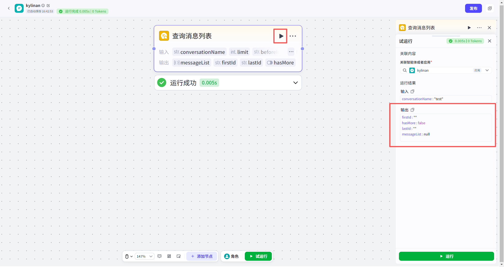

# 查询消息列表节点
#### 1. 功能简介
**“查询消息列表”节点**用于获取指定会话中保存的所有聊天记录。

*   **核心用途**：通常用于在用户界面（UI）上还原历史对话。例如，当用户重新打开一个旧的对话窗口时，通过此节点获取历史消息，并绑定到前端的“列表组件”中，让用户看到之前的完整聊天内容。
*   **数据来源**：包含用户输入的消息和对话流输出的消息。
---
#### 2. ⚠️ 重要说明
*   **查询机制**：默认按**时间倒序**（最新的消息在前）返回，单次最多返回 50 条。

---
#### 3. 节点配置
配置此节点需要处理输入参数，特别是涉及分页的逻辑。

**输入配置**

| 参数名                             | 是否必填 | 类型   | 说明                                                         |
| :--------------------------------- | :------- | :----- | :----------------------------------------------------------- |
| `conversationName`（**会话名称**） | 是       | 字符串 | 目标会话的名称。                                             |
| `limit`（**数量限制** ）           | 否       | 整数   | 本次返回的最大消息数量。默认为 50，取值范围 1~50。           |
| `beforeId`（**起始位置ID** ）      | 否       | 字符串 | **用于向前翻页（查看更早的消息）**。 • 传入空字符串 `""`：表示从最新消息开始查。 • 传入具体值：填入上一页结果中的 `firstId`，以查看更早的消息。 |
| `afterId`（**结束位置ID** ）       | 否       | 字符串 | **用于向后翻页（查看更新的消息）**。 • 传入空字符串 `""`：默认行为。 • 传入具体值：填入上一页结果中的 `lastId`，以查看之后的消息。 |
> **💡 分页逻辑小贴士：**
> 1.  **首次加载**：将 `beforeId` 和 `afterId` 都设为空字符串 `""`，获取最新的 50 条消息。
> 2.  **加载更多（历史）**：将上一次查询结果中的 `firstId` 作为新的 `beforeId` 传入，`afterId` 留空。

**输出结果**
节点执行成功后，会返回消息列表及分页信息：

| 参数名                           | 类型          | 说明                                                         |
| :------------------------------- | :------------ | :----------------------------------------------------------- |
| `messageList`                    | Array(Object) | 消息对象数组，包含具体的消息内容。                           |
| `firstId`                        | String        | 当前返回列表中**最早（最旧）**一条消息的 ID（用于继续向前翻页）。 |
| `lastId`                         | String        | 当前返回列表中**最新**一条消息的 ID（用于继续向后翻页）。    |
| `hasMore`                        | Boolean       | 是否还有更多历史消息。 • `true`：还有更早的消息，可继续翻页。 • `false`：已查到最早的一条。 |
| **`messageList` 内部对象结构：** |               |                                                              |
| 子参数名                         | 类型          | 说明                                                         |
| `messageId`                      | String        | 消息的唯一标识 ID。                                          |
| `role`                           | String        | 消息发送者角色。 • `user`：用户 • `assistant`：智能体（模型） |
| `contentType`                    | String        | 消息类型。 • `1`：文本 • `2`：多模态（图片、文件、语音等） |
| `content`                        | String        | 消息的具体文本内容或多模态数据。                             |
---
#### 4. 试运行与验证
*   **关联资源**：在资源库中试运行时，必须**关联一个具体的应用**。
*   **查看结果**：
    *   试运行成功后，在节点卡片中点击 **“查看数据”**。
    *   您将看到返回的 JSON 数据，其中 `messageList` 数组里详细列出了该会话的历史对话记录。您可以根据返回的 `firstId` 和 `lastId` 验证分页逻辑是否正确。

