# 模型导入教程

## 一、联通元景

### LLM

1、 配置 联通元景 API Key https://maas.ai-yuanjing.com/ 注册登录后，进入以下路径：

元景MaaS平台--工具箱--API Key管理，新建或复制已有密钥。

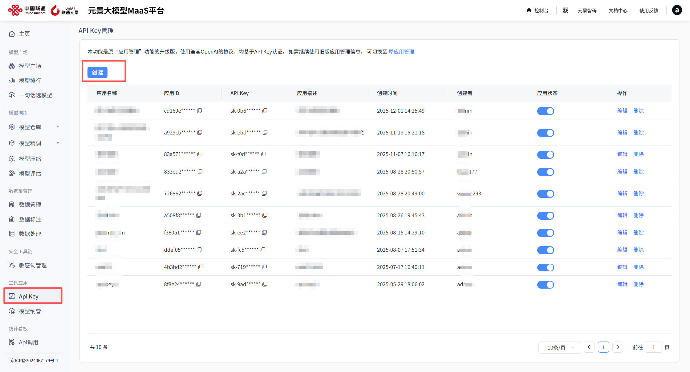

点击创建，填写应用名称及应用描述。确定后，即可生成API Key。

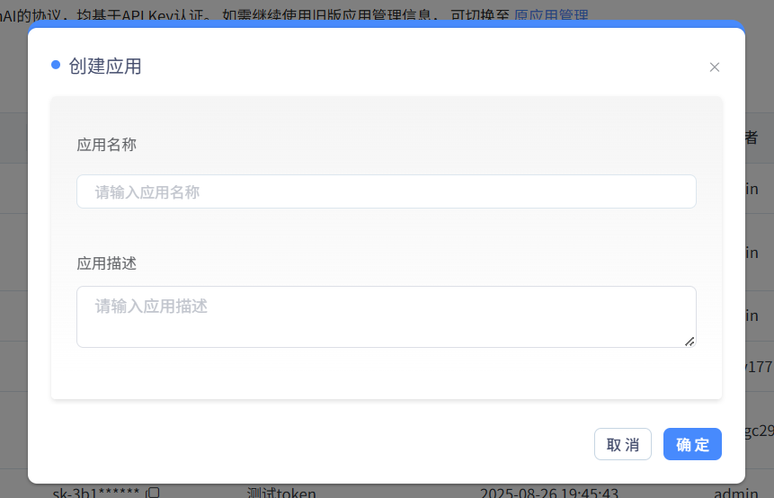

2、获取参数：选择想要导入的模型 https://maas.ai-yuanjing.com/aibase/portal/service

进入模型广场-选择模型-文本生成-点击查看文档

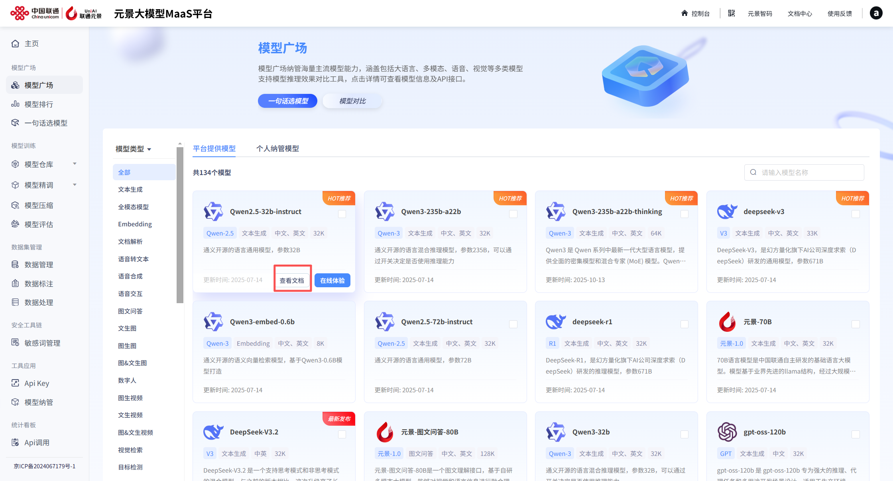

【模型名称】请求参数-model，如deepseek-r1-distill-qwen-32b

【API Key】第一步中申请的API Key

【推理url】请求接口-请求URL：注意推理URL不带 /chat/completions 后缀，例如：https://maas-api.ai-yuanjing.com/openapi/compatible-mode/v1

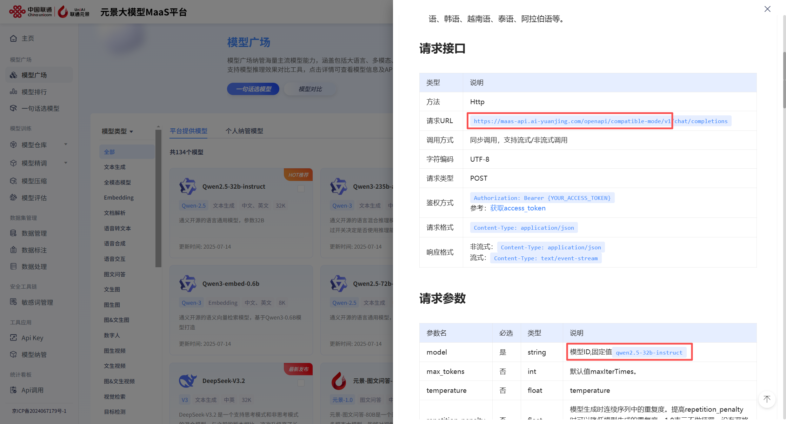

3、登录元景万悟，点击模型管理-模型导入-联通元景-模型类型LLM，依次填写模型名称、API Key、推理url


### Embedding

导入步骤同LLM，只需在文档中心中搜索Embedding模型即可 https://maas.ai-yuanjing.com/doc/pages/216556678/#%E8%AF%B7%E6%B1%82%E6%8E%A5%E5%8F%A3


【模型名称】请求示例中的model，如qwen3-embed-0.6b

【API Key】第一步中申请的API Key

【推理url】复制调用接口：注意推理URL不带 /embeddings 后缀，例如：https://maas-api.ai-yuanjing.com/openapi/compatible-mode/v1

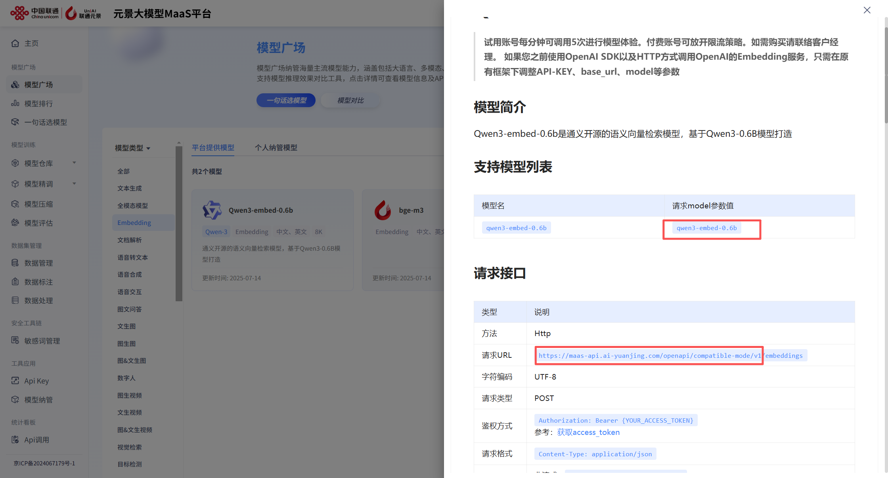

登录元景万悟，点击模型管理-模型导入-联通元景-模型类型Embedding，依次填写模型名称、API Key、推理url


### Rerank

导入步骤同LLM

【模型名称】请求示例中的model，如bge-m3

【API Key】第一步中申请的API Key

【推理url】复制调用接口：注意推理URL不带 /rerank 后缀，例如：https://maas-api.ai-yuanjing.com/openapi/bge/v1


3、登录元景万悟，点击模型管理-模型导入-联通元景-模型类型rerank，依次填写模型名称、API Key、推理url


### OCR

可应用于知识库文件上传-解析方式-OCR解析

【模型名称】固定为 yuanjingOcr

【API Key】第一步中申请的API Key

【推理url】复制调用接口，固定为 https://maas-api.ai-yuanjing.com/openapi/v1

登录元景万悟，点击模型管理-模型导入-联通元景-模型类型OCR，依次填写模型名称、API Key、推理url


### GUI

【模型名称】固定为 gui_agent_v1

【API Key】第一步中申请的API Key

【推理url】复制调用接口，固定为 https://maas-gz-api.ai-yuanjing.com/openapi/v1 或 https://maas-api.ai-yuanjing.com/openapi/v1

登录元景万悟，点击模型管理-模型导入-联通元景-模型类型GUI，依次填写模型名称、API Key、推理url


### 文档解析模型

可应用于知识库文件上传-解析方式-模型解析

【模型名称】固定为 pdf-parser

【API Key】第一步中申请的API Key

【推理url】复制调用接口，固定为 https://maas-api.ai-yuanjing.com/openapi/v1 

登录元景万悟，点击模型管理-模型导入-联通元景-模型类型pdf文档解析模型，依次填写模型名称、API Key、推理url


## 二、阿里通义千问

### LLM

1、 配置 阿里云百炼 API Key https://bailian.console.aliyun.com/?tab=model#/api-key

登录阿里云百炼平台--新用户开通。首次开通需实名制，具体步骤详见https://help.aliyun.com/zh/account/user-guide/individual-identities


2、获取参数：选择想要导入的模型https://bailian.console.aliyun.com/?tab=model#/model-market

进入模型广场-选择模型-点击查看详情和API参考


【模型名称】查看详情后的code，如qwen-max

【API Key】第一步中申请的API Key

【vision】若导入的模型为“视觉理解”模型，则需要把vision选为“支持”

【推理url】查看“API参考”，使用SDK调用：例如 https://dashscope.aliyuncs.com/compatible-mode/v1


3、登录元景万悟，点击模型管理-模型导入-通义千问-模型类型LLM，依次填写模型名称、API Key、推理url


### Embedding

导入步骤同LLM，只需在模型广场中搜索Embedding模型即可 


【模型名称】查看“API参考”-模型名称，如text-embedding-v4

【API Key】第一步中申请的API Key

【推理url】查看“API参考”，快速入门中的示例代码base_url：例如 https://dashscope.aliyuncs.com/compatible-mode/v1


登录元景万悟，点击模型管理-模型导入-通义千问-模型类型Embedding，依次填写模型名称、API Key、推理url


### Rerank

导入步骤同LLM，只需在模型广场中搜索排序模型即可


【模型名称】查看“API参考”-模型名称，，如gte-rerank-v2

【API Key】第一步中申请的API Key

【推理url】复制调用示例中的url：注意推理URL不带/services/rerank/text-rerank/text-rerank后缀，如：https://dashscope.aliyuncs.com/api/v1


登录元景万悟，点击模型管理-模型导入-通义千问-模型类型Rerank，依次填写模型名称、API Key、推理url


## 三、Ollama

### LLM

```
1. 本地Ollama部署：https://github.com/ollama/ollama

2. 用户在在本地启动Ollama服务，并确认服务正常启动，并确认模型已加载，并确认模型可正确请求，以请求qwen2.5:0.5b为例：
   curl --location 'http://本地ip:11434/v1/chat/completions' \
   --header 'Content-Type: application/json' \
   --header 'Accept: application/json' \
   --data '{
           "model": "qwen2.5:0.5b",
           "messages": [{
                   "role": "user",
                   "content": "你好"
           }]
   }'


3. 访问IP（注意localhost要换成本机局域网或对外IP，例如192.168.0.xx，不能是localhost或127.0.0.1）

4. 导入模型：
   4.1【模型名称】必须为上述curl中可以正确请求的model；例如 qwen2.5:0.5b
   4.2【访问IP】注意localhost要换成本机局域网或对外IP，例如192.168.0.xx，不能是localhost或127.0.0.1
   4.3【推理URL】必须为上述curl中可以正确请求的url；例如 http://本地ip:11434/v1（注意不带 /chat/completions 后缀）
```


### Embedding

导入Embedding模型同上述导入LLM，注意推理URL不带 /embeddings 后缀


## 四、火山引擎-豆包

### LLM

1、获取参数：选择想要导入的模型https://console.volcengine.com/ark/region:ark+cn-beijing/model?vendor=Bytedance&view=DEFAULT_VIEW

进入模型广场-选择模型-悬停


【模型名称】悬停后展示的Model ID，如doubao-seed-1-6-thinking-250715

【API Key】点击API接入，创建API Key

【推理url】获取API KEY后，点击“选择使用”，复制链接，注意推理URL不带/chat/completions后缀：例如 https://ark.cn-beijing.volces.com/api/v3


2、登录元景万悟，点击模型管理-模型导入-火山引擎-模型类型LLM，依次填写模型名称、API Key、推理url


### Embedding

导入步骤同LLM，只需在模型广场中搜索向量模型即可


【模型名称】悬停后展示的Model ID，如doubao-embedding-large-text-250515

【API Key】点击API接入，创建API Key

【推理url】获取API KEY后，点击“选择使用”，复制base_url，注意推理URL不带/embeddings后缀：例如 https://ark.cn-beijing.volces.com/api/v3


登录元景万悟，点击模型管理-模型导入-火山引擎-模型类型Embedding，依次填写模型名称、API Key、推理url


## 五、无问芯穹

### LLM

1、 配置 无问芯穹 API Key  https://cloud.infini-ai.com/iam/secret/key


2、获取参数：选择想要导入的模型https://cloud.infini-ai.com/genstudio/model

进入模型广场，点击进入要选择的模型


点击调用说明，选择默认接口：

【模型名称】model，如deepseek-v3.1

【API Key】第一步中申请的API Key

【推理url】接口文档中url，复制链接，注意推理URL不带/chat/completions后缀：例如 https://cloud.infini-ai.com/maas/v1

3、登录元景万悟，点击模型管理-模型导入-无问芯穹-模型类型LLM，依次填写模型名称、模型显示名称、API Key、推理url


### Embedding

导入步骤同LLM，只需在模型广场中筛选“文本向量”模型即可 


点击调用说明，选择默认接口：

【模型名称】model，如bge-m3

【API Key】第一步中申请的API Key

【推理url】接口文档中url，复制链接，注意推理URL不带/chat/completions后缀：例如 https://cloud.infini-ai.com/maas/v1


登录元景万悟，点击模型管理-模型导入-无问芯穹-模型类型Embedding，依次填写模型名称、API Key、推理url


### Rerank

导入步骤同LLM，只需在模型广场中搜索“rerank”模型即可 


点击调用说明，选择默认接口：

【模型名称】model，如bge-reranker-v2-m3

【API Key】第一步中申请的API Key

【推理url】接口文档中url，复制链接，注意推理URL不带/chat/completions后缀：例如 https://cloud.infini-ai.com/maas/v1


登录元景万悟，点击模型管理-模型导入-无问芯穹-模型类型Rerank，依次填写模型名称、API Key、推理url


## 六、OpenAI-API-compatible

平台支持导入所有符合OpenAI协议的模型，包括联通元景、火山引擎等上述模型供应商提供的模型。具体导入方式详见上文。


## 七、百度千帆

### LLM

1、 配置 百度千帆 API Key https://console.bce.baidu.com/iam/#/iam/apikey/list

登录百度云千帆-控制台-安全认证-API Key，创建API Key，具体操作详见官方操作手册https://cloud.baidu.com/doc/qianfan-api/s/ym9chdsy5

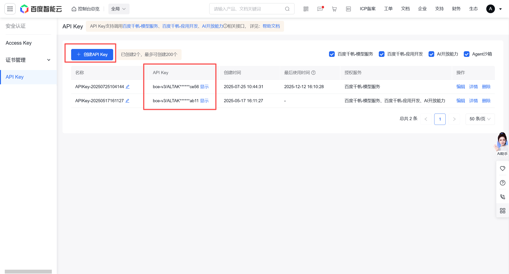


2、获取参数：选择想要导入的模型https://console.bce.baidu.com/qianfan/modelcenter/model/buildIn/list

进入模型广场-选择模型-点击“使用此模型”-“API文档”，筛选“文本生成”或“视觉理解”模型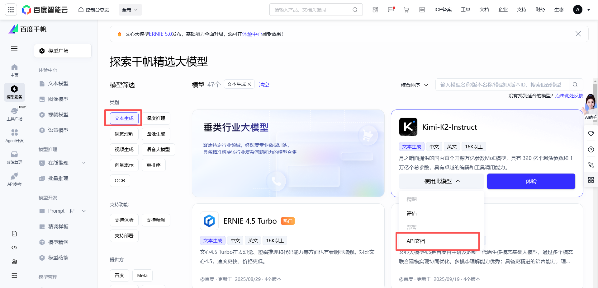

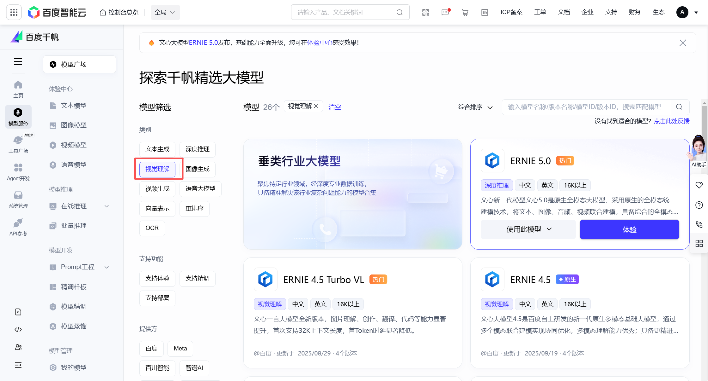

【模型名称】模型列表中的model参数接入点ID，如：deepseek-v3.1-250821，模型列表（如下图）：https://cloud.baidu.com/doc/qianfan/s/rmh4stp0j

【API Key】第一步中申请的API Key

【vision】若导入的模型为“视觉理解”模型，则需要把vision选为“支持”

【推理url】查看“API文档”，POST，不需要/chat/completions：例如https://qianfan.baidubce.com/v2

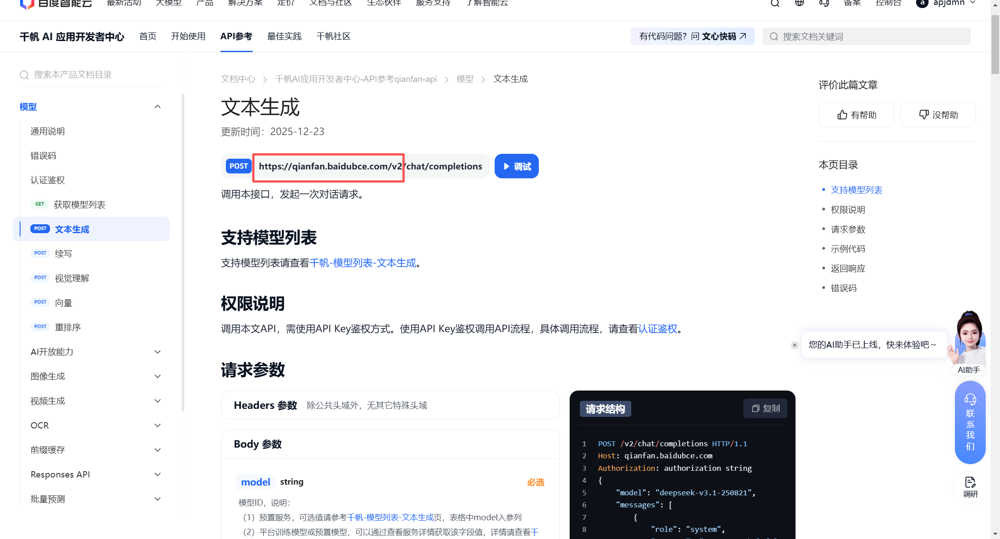


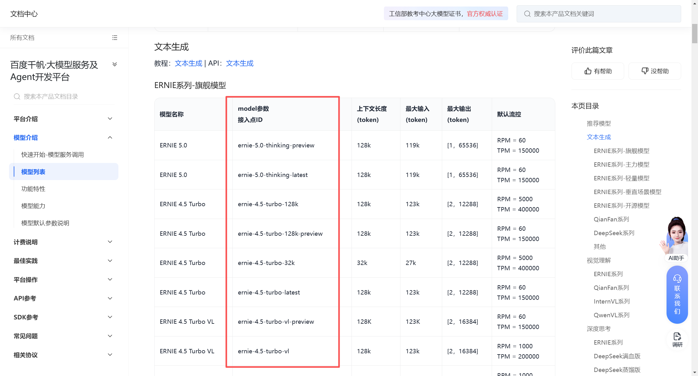


3、登录元景万悟，点击模型管理-模型导入-百度千帆-模型类型LLM，依次填写模型名称、API Key、推理url

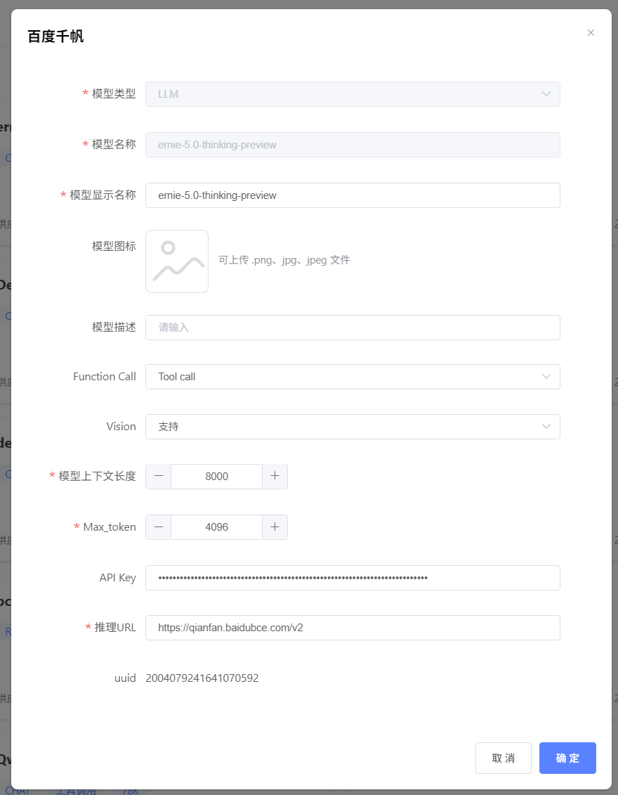

### Embedding

导入步骤同LLM，只需在模型广场中搜索“向量表示”模型即可 

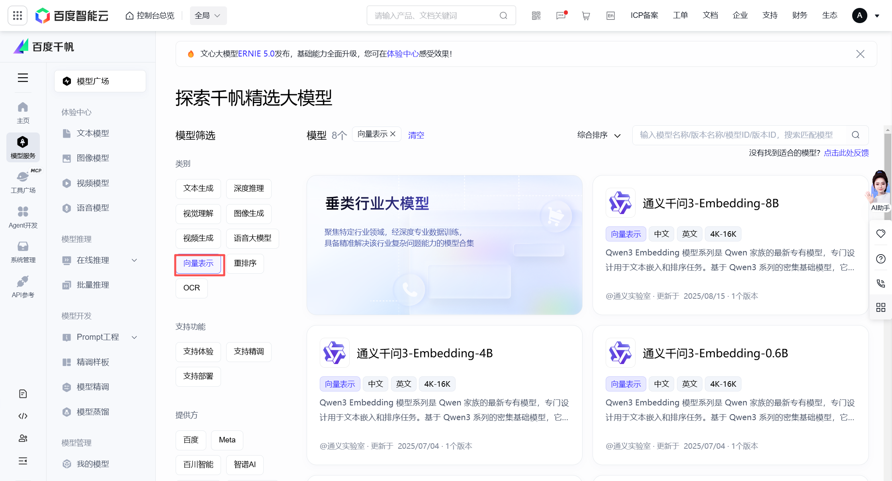


【模型名称】模型列表中的model参数接入点ID，如：embedding-v1，可通过支持模型列表，查看模型ID（如下图）：https://cloud.baidu.com/doc/qianfan/s/rmh4stp0j#%E6%96%87%E6%9C%AC%E5%90%91%E9%87%8F

【API Key】第一步中申请的API Key

【推理url】查看“API文档”，POST，不需要/chat/completions：例如https://qianfan.baidubce.com/v2

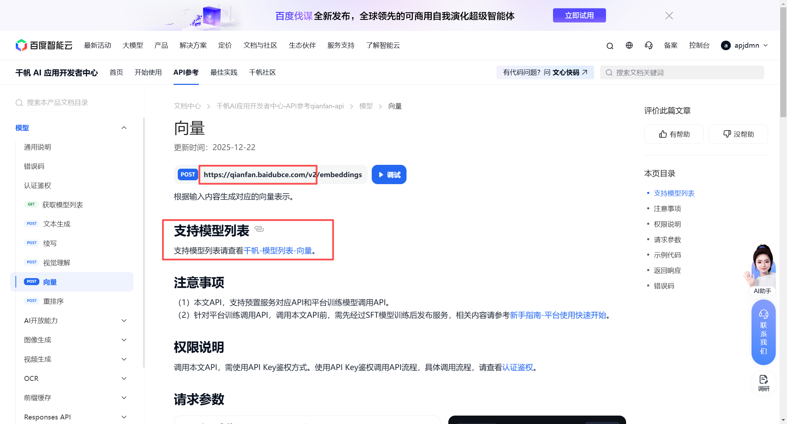

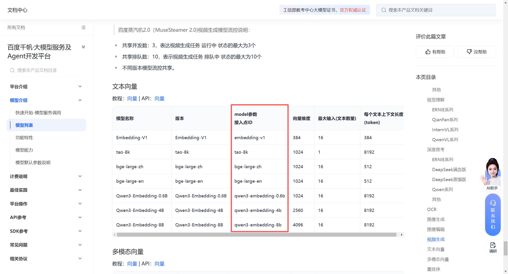

登录元景万悟，点击模型管理-模型导入-百度千帆-模型类型Embedding，依次填写模型名称、API Key、推理url

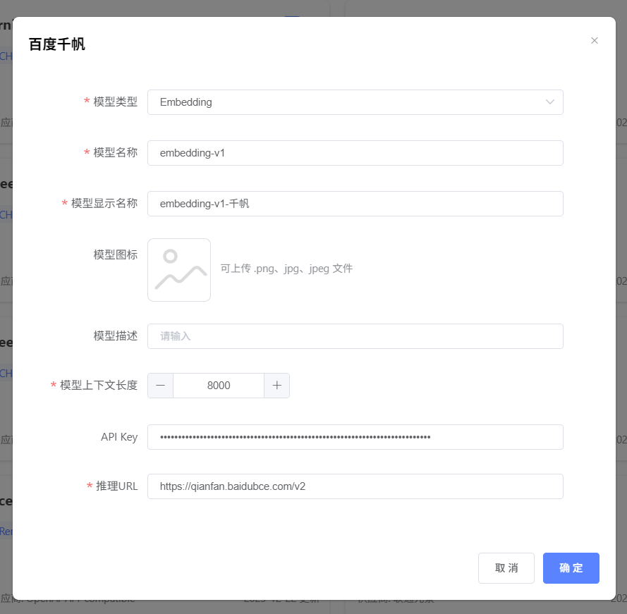

### Rerank

导入步骤同LLM，只需在模型广场中搜索“重排序”模型即可 

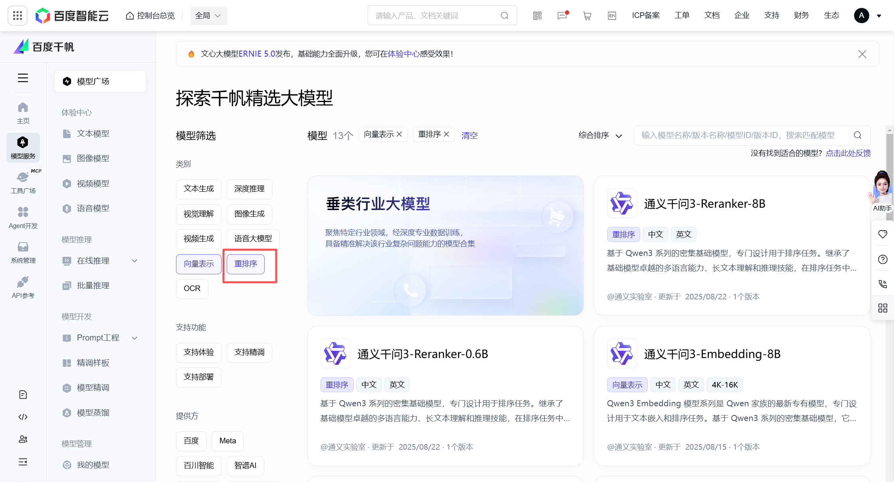

【模型名称】模型列表中的model参数接入点ID，如：bce-reranker-base，可通过支持模型列表，查看模型ID（如下图）：https://cloud.baidu.com/doc/qianfan/s/rmh4stp0j#%E9%87%8D%E6%8E%92%E5%BA%8F

【API Key】第一步中申请的API Key

【推理url】查看“API文档”，POST，不需要/chat/completions：例如https://qianfan.baidubce.com/v2


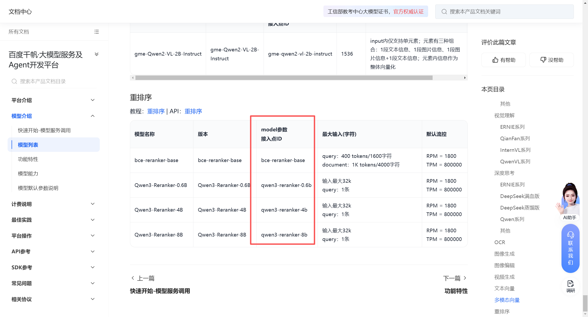

登录元景万悟，点击模型管理-模型导入-百度千帆-模型类型Rerank，依次填写模型名称、API Key、推理url

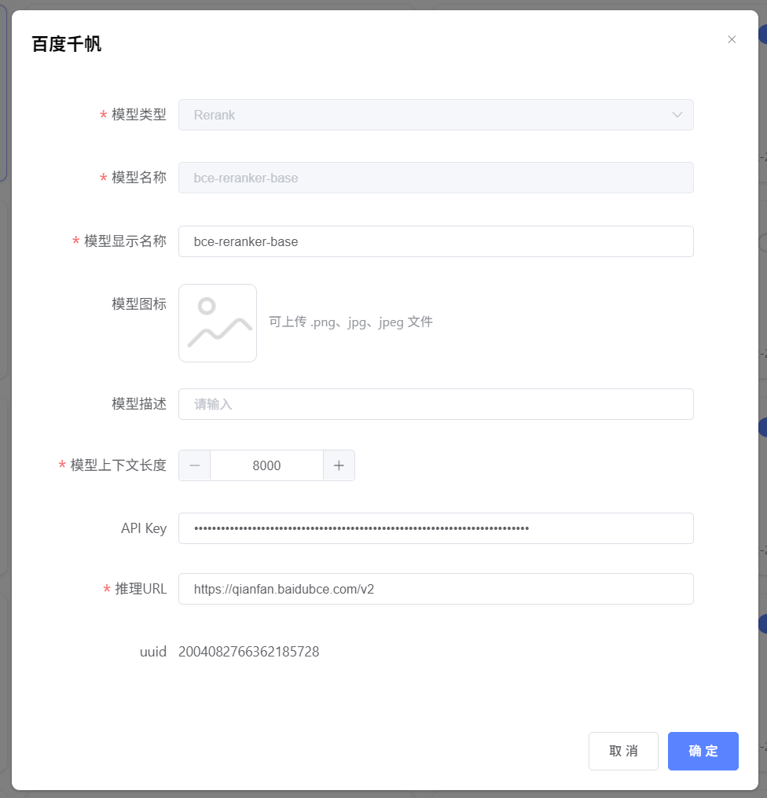

## 八、DeepSeek

### LLM

1、 配置 DeepSeek API Key https://platform.deepseek.com/api_keys

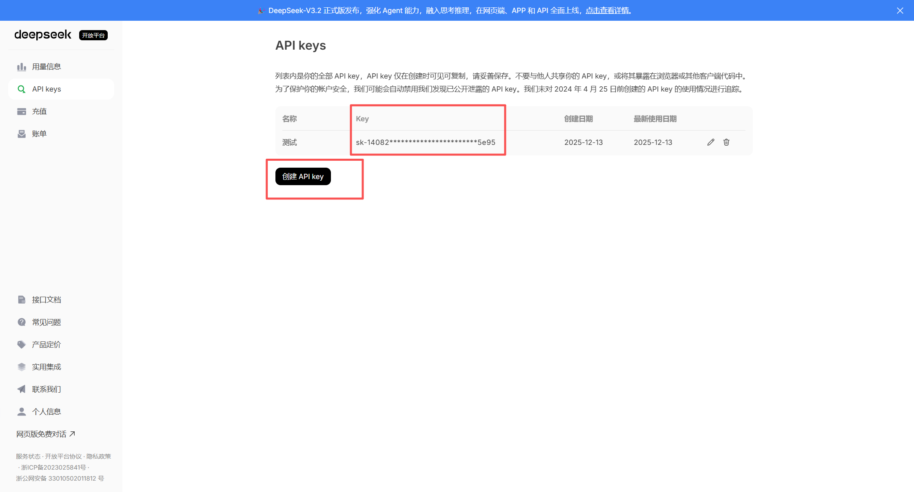

2、获取参数：https://api-docs.deepseek.com/zh-cn/

DeepSeek提供两类模型：**`deepseek-chat`**、**`deepseek-reasoner`**

【模型名称】**`deepseek-chat`**、**`deepseek-reasoner`**

【API Key】第一步中申请的API Key

【推理url】https://api.deepseek.com/v1

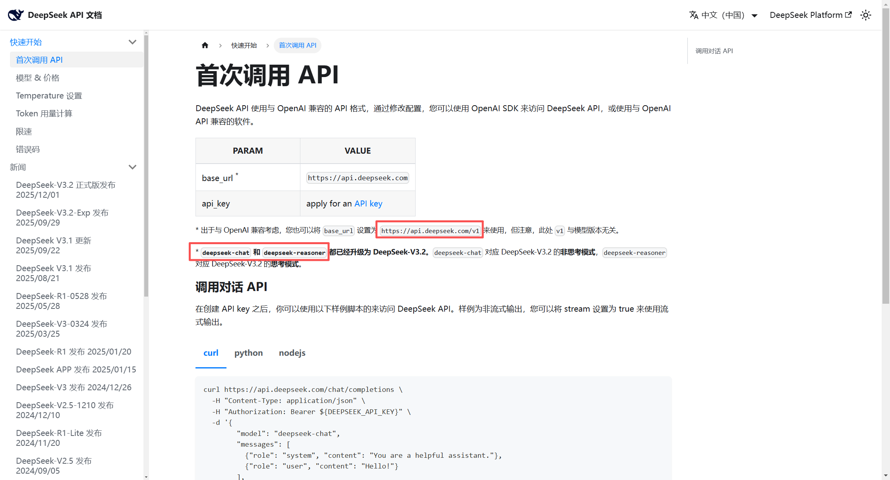


3、登录元景万悟，点击模型管理-模型导入-DeepSeek-模型类型LLM，依次填写模型名称、API Key、推理url

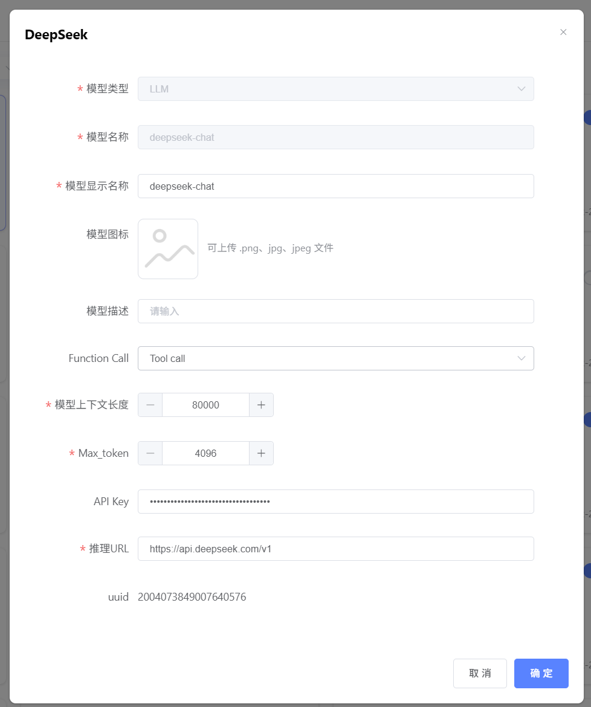
